<h1 align="center">⚡️💻 JavaScript 📜✨</h1>

* JavaScript is light weight Interpreted and Just-in-Time Compiled programming language.
* Light weight refers to memory occupied and how heavy the application is.
* Interpreted refers to line by line translation.

## JavaScript as Scripting language (Control flow)

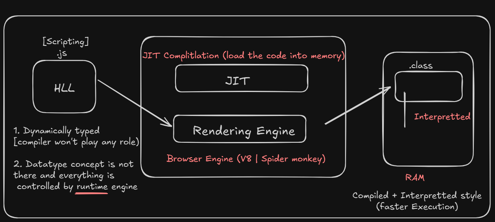

## JavaScript as Programming language (Control flow)


## JavaScript History   
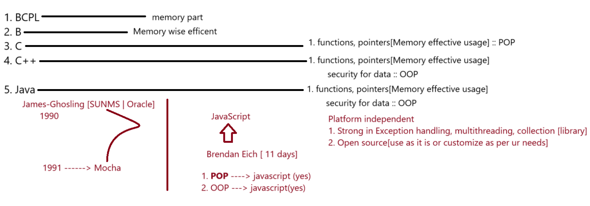

## Characteristics

- **Lightweight**: Refers to the memory usage and the overall "heaviness" of the application.
- **Interpreted**: Code is executed line-by-line.
- **Compiled**: The entire program is translated simultaneously.

## Types of Compilation

1. **JIT (Just-in-Time Compilation)**  
   - JavaScript is loaded into the browser and compiled by the browser.  
   - Happens when the user sends a request.

2. **AOT (Ahead-of-Time Compilation)**  
   - JavaScript is compiled and processed at the application level.  
   - Occurs even before a user request is made.


## Engines and Compilers

JavaScript can be processed using various engines and compilers:

- **Ivy**
- **Babel**
- **Node**
- **V8**


## Programming Paradigms Supported

JavaScript supports a variety of programming techniques:

1. Structural Programming  
2. Functional Programming  
3. Imperative Programming  
4. Object-Oriented Programming (OOP)

> **🔔Note:** JavaScript is **not** a fully object-oriented programming language. It supports only some OOP features.


## 🧩Usage of JavaScript in Project Layers

JavaScript can be used at various levels of a software project:

1. **Client Side**: With HTML
2. **Server Side**: With Node.js
3. **Database**: With MongoDB
4. **Animation Tools**: Flash, 3DS Max, etc.


## Typical Full Stack Setup

```plaintext
Frontend          =>      Backend         =>      Database
 React.js         =>       Node.js        =>       MongoDB          
                           express.js
```

## FAQ

### 1. What are the issues with JavaScript?

JavaScript has several notable limitations:

- **Not strongly typed**: Variables can hold any data type without explicit declaration
  ```javascript
  a = 10;        // number
  a = "sachin";  // string
  a = false;     // boolean
  a = 13.5;      // float
  ```

- **Not strictly typed by default**: Variables can be used without declaration
  ```javascript
  // This works in non-strict mode
  a = 10;
  
  // To enforce stricter behavior:
  "use strict";
  a = 10;  // This would throw an error in strict mode if 'a' is not declared
  ```

- **Inconsistent data structures**: Doesn't enforce uniform object structures
  ```javascript
  [
    {
      Name: "Samsung", 
      price: 45000
    },
    {
      Product: "LG", 
      cost: 55000  // Different property names for similar concepts
    }
  ]
  ```

- **Security concerns**: JavaScript can be blocked by browsers due to security risks
  - Example: Malicious scripts like Trojans that can control devices (bad approach)
  - Legitimate tools like TeamViewer that control devices for installation help (good approach)


# JavaScript – Client Side

The main purpose of JavaScript on the **client side** is to reduce the burden on the server.  
It improves the performance of the application by handling various interactions on the client side.


## Client-Side Interactions

### 1. DOM Manipulation
JavaScript allows dynamic interaction with the Document Object Model (DOM), including:

- Adding elements to the page
- Removing elements from the page
- Updating data within elements
- Dynamically applying styles to elements
- Dynamically configuring events for elements

### 2. Form Validation
JavaScript is commonly used to validate user input before sending data to the server.

### 3. Client Management

- **Memory Management**: For example, storing the username and password in cache memory.
- **Device Interaction**: Managing device-specific tasks, such as printing a ticket without needing an internet connection.
- **Location Management**: Websites can request the user's location using client-side JavaScript.
- **Data Sharing**: Enables sharing of data with other applications on the client device.


> ## How the JavaScript would take control over HTML elements (or) In how many ways we can write the javascript code in HTML page

* **HTML Elements**
  1. Static – Elements that do not change after the page loads.
  2. Dynamic – Elements that change based on user interaction or scripting (JavaScript).

* **Styling**
  * a. Inline – Style written directly inside the element.
    ```html
    <p style="color: blue;">This is an inline styled paragraph.</p>
    ```
  * b. Embedded – CSS written inside `<style>` tags, placed within `<head>` or `<body>` (not outside `<body>`).
    ```html
    <head>
      <style>
        h1 {
          color: green;
        }
      </style>
    </head>
    ```
  * c. External – CSS written in an external file and linked to the HTML using:
    ```html
    <head>
      <link rel="stylesheet" href="styles.css">
    </head>
    ```

* **Dynamic (JavaScript)**
  * a. Inline – Script written directly inside the element using event attributes.
    ```html
    <button onclick="alert('Hello!')">Click Me</button>
    ```
  * b. Embedded – Script written inside `<script>` tags placed within `<head>` or `<body>` (not outside `<body>`).
    ```html
    <head>
      <script>
        function greet() {
          alert("Welcome!");
        }
      </script>
    </head>
    ```
  * c. External – JavaScript written in an external file and linked to the HTML using:
    ```html
    <script src="script.js" type="text/javascript"></script>
    ```

### Window hieracrchy

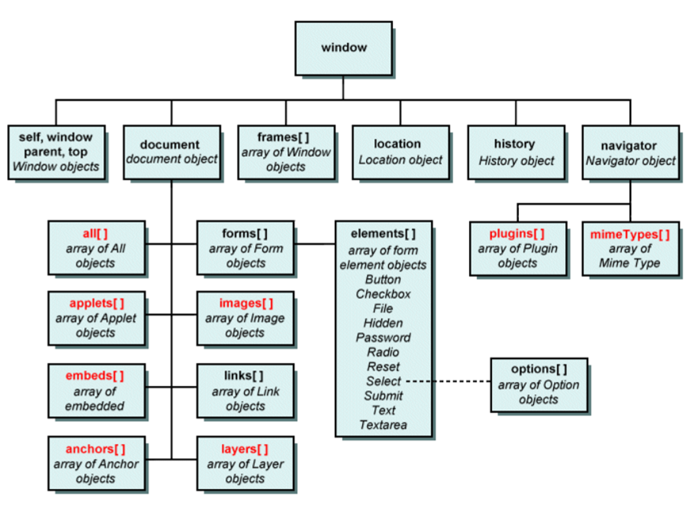

### Bulk loading

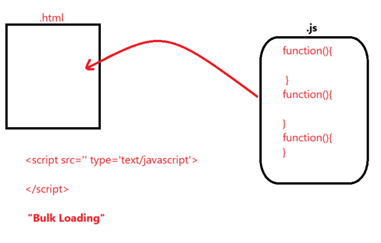


### Specific Function Loading

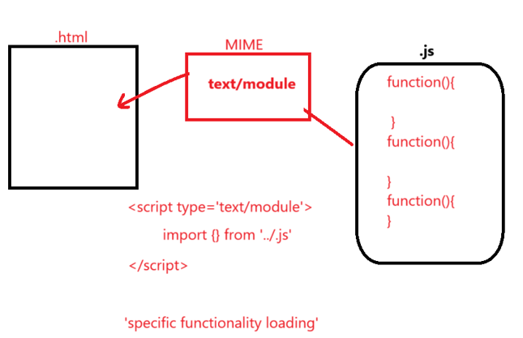


## JavaScript FAQ

### 1) What is the MIME type for script?
The MIME type for JavaScript is `text/javascript`.

### 2) What is difference between script in head and body?
- **head →** Script would be loaded into browser memory and later used in the page.
- **body →** Script would be loaded directly into the page and it is not a part of browser memory.

### 3) How JavaScript converts Static DOM into Dynamic DOM?
- **HTML →** HTML parser → Static DOM
- **CSS →** CSS parser → Uses static DOM and changes the style of an element using CSSOM.
- **JS →** JavaScript engine → Uses STATIC DOM and converts it into Dynamic DOM using 'events and functions'.
- static then id, dyamiclly loaded means then className, name

### 4) What is strict mode for JavaScript?
Without declaring a variable, if we don't want JavaScript to permit the usage of variables, then we need to use "strict mode".

### 5) How to target JavaScript for Legacy browsers? [Old Version Browsers]
Developer can target new JavaScript code to the legacy browser by enclosing the code in HTML comments.

Syntax:
```html
<script type="text/javascript">
    <!--
        "use strict";
        ...... 
        ......
    -->
</script>
```

### 6) How to link external javascript file to html?
```html
<script src="path-to-file.js">
</script>
```

## JavaScript Properties vs testContent

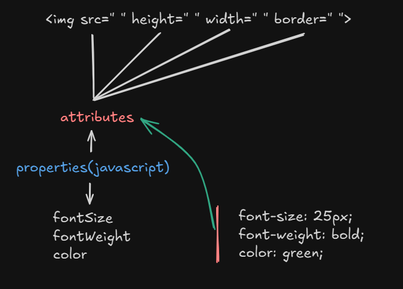 

### Text content

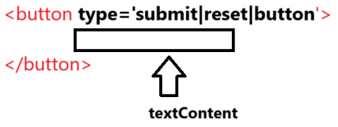 


> #### If we target the element using DOM hieracrchy it might result in code breaks when DOM structure is changed.
**Solution:** use ID and target the element 

> 💻 Related Code :  <a href="../JavaScript examples/dom-hierarchy-code.html">Click on this</a>

### ⚠️ Disadvantage of Using DOM Hierarchy for Targeting Elements

- If we target elements using **DOM hierarchy**, the code might **break** when the DOM structure is altered or changed.


- ✅ Solution : Use **ID** to target the element directly and reliably:
  ```javascript
  document.getElementById("myElement");
  ```


### 🆔 Targeting Elements Using ID Selector

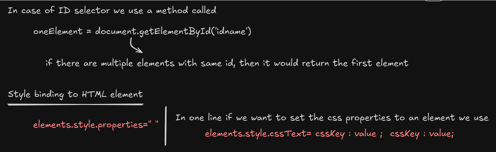 


- We use the method:
  ```javascript
  const oneElement = document.getElementById('idname');
  ```
- If there are multiple elements with the **same ID**, the method will return only the first matching element.
  ```javascript
  document.getElementById("idname");
  ```

### 🎨 Style Binding to HTML Elements

- To bind a single CSS property to an element:
  ```javascript
  element.style.property = "value";
  ```
- ✅ To set multiple CSS properties in one line:
  ```javascript
  element.style.cssText = "cssKey1: value1; cssKey2: value2;";

  element.style.cssText = "color: blue; background-color: yellow;";
  ```

> 💻 Related Code : 
<a href="../JavaScript examples/using-multiple-id.html">Click on this</a>


## Accessing the Elements in JS

### <u>By ID Name</u>

**document.getElementByTagName() : Element**

 For Code <a href="../JavaScript examples/using-id-code.html">Click on this</a>

### <u>By Class Name</u>

**document.getElementByClassName() : HTMLCollection[]**

* For Code <a href="../JavaScript examples/using-class-code.html">Click on this</a>

* How to convert HTMLCollection to Array?
ans. arrayElements=Array.from(HTMLCollection)

### Working with iterator called "forEach"

* It can be used only on Array object.
```js 
const callbackFunction = (value, index, arr) => {
  // value -> current element
  // index -> index of the current element
  // arr   -> the entire array
};

// Usage
array.forEach(callbackFunction);
```

### 1️⃣ <u>By Tag Name</u>

**document.getElementByTagName() : HTMLCollection[]**

 For Code <a href="../JavaScript examples/using-tag-name.html">Click on this</a>

 Another approach to convert HTMLCollection to Array "[...HTMLCollection]"

### 2️⃣<u>By Name</u>

**document.getElementByName() : NodeList**

 For Code <a href="../JavaScript examples/using-name-code.html">Click on this</a>

 While working with NodeList,directly we an use forEach() without any conversion

### 3️⃣<u>By QuerySelector</u>

 
**document.querySelector(cssSelector) : Element**

**document.querySelectorAll(cssSelector) : NodeList**

 querySelector(cssSelector) | querySelectorAll(cssSelector) to target the element in a HTML page.

 For Code <a href="../JavaScript examples/querySelector-code.html">Click on this</a>

 ### Working with different techniques to access DOM
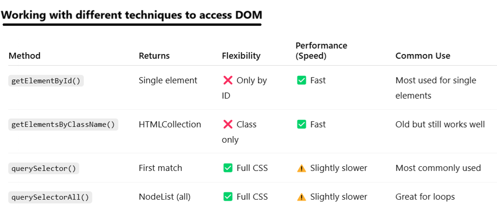


## FAQ

### 1) Why do we need do many methods to target HTML page using javascript , when we can target directly with single method called 'querySelectorXXX()'?
**Ans.**
Older version of javascript added methods like getElementById( ), getElementByClassName( ), getElementByTagName( ) ,. . . . . . <br>
As css become popular, to give the direct support of accessing the elements using CSS methods like querySelector( ) and querySelectorAll( ) were added.

### 2) Difference between querySelector and getElementBy

> querySelector( ) | querySelectorAll( ) | getElementById( ) ===> works only for static DOM
<br>

>  getElementsByClassName( ) | getElementsByTagName( ) | getElementsByName( ) ===> Dynamic DOM

* For Code <a href="../JavaScript examples/static-dynamic-dom.html">Click on this</a>


**NOTE:**
HTMLCollection is a object first we need to convert to array and we should use it 
```js
elements = document.getElementsByClassName("box");
console.log(typeof elements); // Output: object

Array.from(elements).forEach((value) =>{
        value.style.cssText = "color: red; font-size: 25px; font-weight: bold;";
    })
  
elements.forEach((value) =>{
        value.style.cssText = "color: red; font-size: 25px; font-weight: bold;";
    })

```
## Static vs. Dynamic DOM Access — What's the difference?

### Static DOM Access
* Happens once, at the time of accessing.
* If DOM elements change later, the reference does not update.
* Example: querySelectorAll() returns a NodeList, which is static.


### Dynamic (Live) DOM Access
* Reflects changes automatically.
* If new elements are added or removed, the collection updates itself.
* Example: getElementsByClassName() returns an HTMLCollection, which is live.

### Static vs. Dynamic DOM
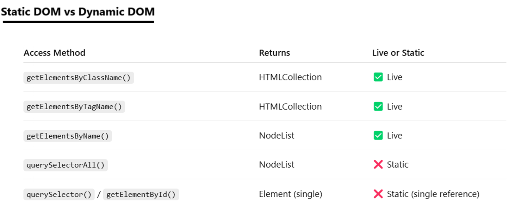

### Example:
```html
<div id="container">
  <p class="item">Item 1</p>
  <p class="item">Item 2</p>
</div>

<button onclick="addItem()">Add Item</button>

<script>
  const liveList = document.getElementsByClassName("item"); // Dynamic (live)
  const staticList = document.querySelectorAll(".item");    // Static (snapshot)

  function addItem() {
    const p = document.createElement("p");
    p.className = "item";
    p.textContent = "New Item";
    document.getElementById("container").appendChild(p);

    console.log("Live (HTMLCollection):", liveList.length);   // Updates
    console.log("Static (NodeList):", staticList.length);     // Does not update
  }
</script>
```

# JavaScript Output Techniques

| Method                  | Description |
|--------------------------|-------------|
| `alert()`                | Shows a simple alert message with an OK button. |
| `confirm()`              | Displays a message box with OK and Cancel buttons. Returns a boolean. |
| `document.write()`, `document.writeln()` | Writes directly to the HTML output stream. |
| `innerHTML`, `outerHTML` | Used to get/set HTML content of elements. |
| `innerText`, `outerText` | Used to get/set the visible text of elements. |
| `textContent`            | Retrieves or sets the text content of a node and its descendants. |
| `console.log()`, `console.warn()`, `console.error()`, `console.info()`, `console.debug()` | Used for debugging outputs to the console. |


## JavaScript Output Operations 💬

- 1️⃣ **`alert()`** 🚨  
- 2️⃣ **`confirm()`** ✅❌  
- 3️⃣ **`document.write()` | `document.writeln()`** 📝  
- 4️⃣ **`innerHTML` | `outerHTML`** 🔄  
- 5️⃣ **`innerText` | `outerText`** 📝  
- 6️⃣ **`textContent`** 🖋️  
- 7️⃣ **`console.XXXXX()`** [log(), warn(), error(), info(), debug()] 🖥️


---

### 1️⃣ `alert(msg)` 🚨: `void`
- Displays a message with an "OK" button.
- Returns `undefined` when the user clicks "OK" or presses the "ESC" key.
- Primarily used to display messages.

#### Limitation 🚫
- ❌ No styling can be added to the message.
- ❌ No "Cancel" button, so the user must click "ESC" to exit.

---

### 2️⃣ `confirm(msg)` ✅❌: `boolean`
- Displays a message with "OK" and "Cancel" buttons.
- Returns `true` when the user clicks "OK" and `false` when the user clicks "Cancel".

#### Limitation 🚫
- ❌ No styling can be added to the message.

> 💻 Related Code : 
<a href="../javascript-output-techniques/confirm-code.html">confirm-code.html</a>
---
### 3️⃣ `document.write(msg)` 📝

- Accepts `msg` as a **string** or **HTML elements**.
- Directly writes content into the HTML document.

---

#### Limitation 🚫
- `document.write()` can behave **unexpectedly** if used **after** the page has finished loading — it can overwrite the entire document.


#### ⚙️ Output Behavior of `document.write()`

##### 🔍 What Happens When You Click the Button?

- 🧨 The entire existing page (including the button, heading, etc.) gets **wiped out**.
- Only the content inside `document.write(...)` is displayed.

##### ❓ Why Does This Happen?

- After the page finishes loading, `document.write()` acts like:
  > "Let me 🧹 rebuild the entire document from scratch now!"

> 💻 Related Code : 
<a href="../javascript-output-techniques/document-write-code.html">javascript-output-techniques</a>

### 4️⃣ `innerHTML` vs `outerHTML` 🧱

- **`innerHTML`**: Adds the element as a **child** to the targeted container or element. 👶  
- **`outerHTML`**: **Replaces** the entire targeted element with the newly provided one. 🔁

> 💻 Related Code : 

<a href="../javascript-output-techniques/innerHTML-outerHTML.html">javascript-output-techniques</a>

---
### 5️⃣  `innerText` vs `outerText` ✍️

- Works like `innerHTML` and `outerHTML` ✅  
- But only for **text content** — no HTML or styles allowed 🛑
> 💻 Related Code : 
<a href="../javascript-output-techniques/innerText-outerText.html">innerText-outerText.html</a>

---

### 6️⃣ `textContent` 🖋️

- Used to get or set the **text content** of an element.
- Returns all the text within an element, **including text from hidden elements**.
- Does **not parse HTML**—purely works with plain text.
- Ideal when you're working with content programmatically and **don't need styling awareness**.


---

#### 📌 Difference: `innerText` vs `textContent`

- **`textContent`**  
  ✔️ Returns **all text**, including from **hidden elements**  
  ✔️ **Faster** and better for **raw text**  
  ✔️ Ignores CSS layout and visibility  

- **`innerText`**  
  ✔️ Returns only **visible text**  
  ✔️ Respects **CSS visibility** and **layout**  
  ✔️ Includes **line breaks and spacing** as shown on screen  

> ⚠️ Use `textContent` for performance.  
> 🎯 Use `innerText` for accurate, visible representation.

> 💻 Related Code : 
<a href="../javascript-output-techniques/textContent-innerText.html">textContent-innerText.html</a>

---
### 7️⃣🧾 Logs

- Logs refer to the **actions performed by the end user**.  
To **track user behavior or activity**, we use logs in JavaScript (commonly via `console.log()` or other logging tools).

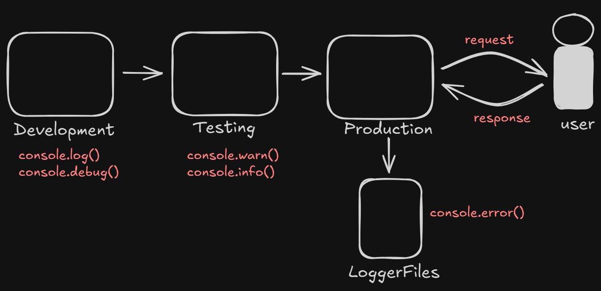

> 💻 Related Code : 
  <a href="../javascript-output-techniques/ConsoleLog-info.html">ConsoleLog-info.html</a>
---


# Javascript input mechanism

a. prompt()  
b. queryString  
c. formelements


## 📥 1. JavaScript `prompt` Behavior
Returns: `string` | `null`

### 🖋️ Description
The `prompt` function shows a dialog box asking the user for input.  
Depending on how the user responds, it returns different values:

---

### 🧠 Behavior Table

| User Action                                   | Result                      |
|-----------------------------------------------|------------------------------|
| ✅ User enters data and clicks **OK**         | `'data'` (string with value) |
| ⚪ User leaves input **empty** and clicks **OK** | `''` (empty string)          |
| ❌ User clicks **Cancel** or presses **ESC**  | `null`                      |

---

✅ **Tip**: Always check if the result is `null` before using the value to avoid errors! 🚀

### **prompt("MSG",[default msg]);**

``` javaScript
prompt("Enter the name", "Enter in UpperCase");
```

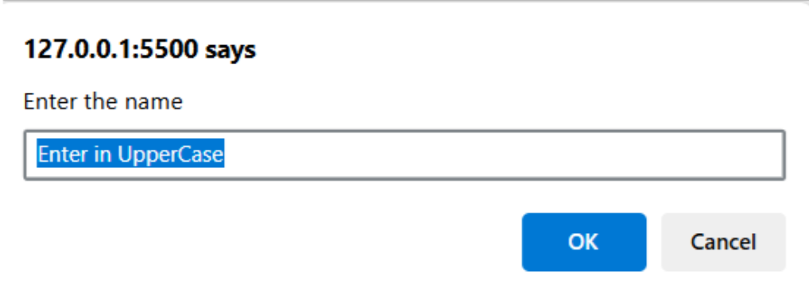

## 🌐 2. queryString

It is a combination of **URL + queryParameters (Key, Value)**.

To collect the queryString we use **BOM** (Browser Object Model):  
```javascript
queryString = location.search;
```

QueryString data is received as a **string**.  
String has various methods to process our input:

- a. `slice(start)`
- b. `indexOf('')`

> 💻 Related Code : 
  <a href="../javascript-output-techniques/queryString.html">ConsoleLog-info.html</a>


## Practice Codes

> 💻 BookMyShow Code : 
  <a href="../JavaScript-bootstrap/bookMyShow.html">bookMyShow.html</a>


> 💻 Add Product Code : 
  <a href="../JavaScript-bootstrap/addProduct.html">addProduct.html</a>

# 🚀 How JavaScript Program is Executed (or How JavaScript Runs in the Browser)

* When JavaScript is loaded into the browser's engine, it forms an **Execution Engine** ⚙️  
  Inside the **Execution Context**, there are two main areas:
  1. 🧠 **Memory (Variable Environment)** – stores variables and function declarations
  2. 🔁 **Code Execution (Thread of Execution)** – executes code line by line

### 🖥️ JavaScript in Browser Engine  
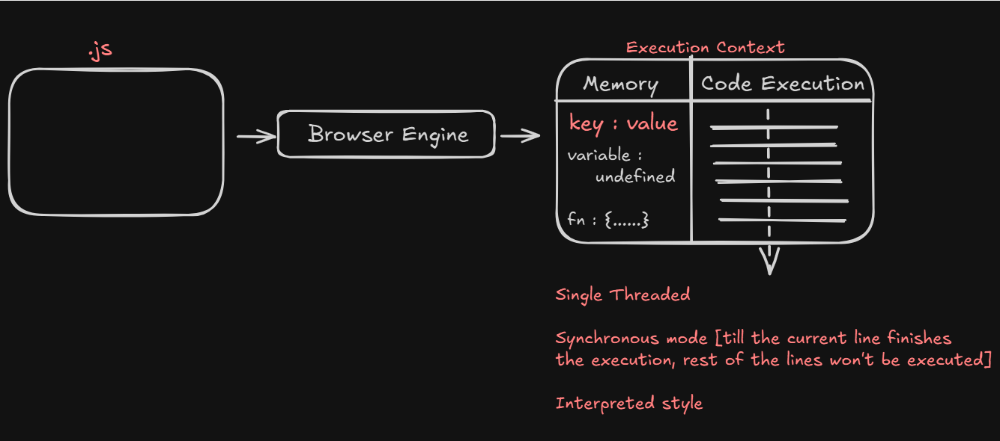

* First, a **Global Execution Context (GEC)** is created automatically 🌐  
  Then, whenever a function is invoked, a **new Execution Context** is created and pushed onto the **Call Stack**, as shown below:

### 📦 Execution Context Stack  
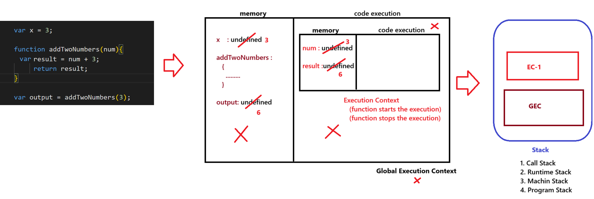

---

### 📝 Additional Points:

* JavaScript is **synchronous and single-threaded** 🧵 — it can only execute one command at a time in a specific order.

* The **Call Stack** 📚 keeps track of execution contexts — the one on top is always the currently running context.

* The **Execution Context** is created in two phases:
  1. 🔍 **Memory Creation Phase** – variables and functions are stored in memory (hoisted).
  2. ▶️ **Code Execution Phase** – code runs line by line using the stored memory.

---

> 💻 **Execution Context Code Example**:  
> <a href="../javaScript-flow/executionContext.html">executionContext.html</a>


# Hosting

- Hoisting is a phenomenon in JavaScript where **variables and functions can be used before they are initialized**.
- If a `var` variable holds a **function expression** or an **arrow function**, it **cannot** be used before initialization.
- Trying to do so will result in a **`TypeError`**.

> 🔔 **Note:**  
> ✅ `undefined` is printable.  
> ❌ `null` and `void` are not printable as meaningful output.


### Example 1 -> <a href="../javascript-variable-declaration/sample-code.html">sample-code.html</a>
```javascript
    var x=3;
    function getName(){
        console.log("PW IOI Javascript");
    }
    console.log(x);
    console.log(getName);
    getName();
```
**Soution:**

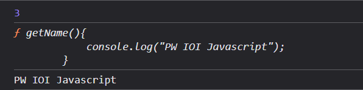

### Example 2 -> <a href="../javascript-variable-declaration/sample-code-2.html">sample-code-2.html</a>
```javascript
    console.log(x);
    console.log(getName);
    getName();

    var x=3;
    function getName()
    {
        console.log("PW IOI Javascript");
    }
```
**Soution:**

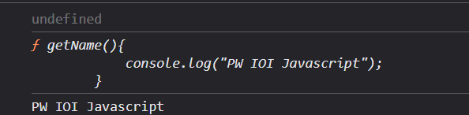

### Example 3 -> <a href="../javascript-variable-declaration/sample-code-3.html">sample-code-3.html</a>
```javascript
    console.log(x);
        console.log(getName);
        getName();
        console.log(getName1);
        getName1();
         
        var x=3;
        function getName(){
            console.log("PW IOI Javascript");
        }

        var getName1=function(){
            console.log("PW IOI React")
        }
        getName1();
```
**Soution:**

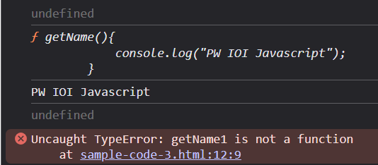

### Example 4 -> <a href="../javascript-variable-declaration/sample-code-4.html">sample-code-4.html</a>
```javascript
    console.log(x);
    console.log(getName);
    getName();
    
    console.log(getName2);
    getName2();
    console.log(getName1);
    getName1();
    var x=3;
    function getName(){
        console.log("PW IOI Javascript");
    }

    var getName1=function(){
        console.log("PW IOI React")
    }
    
    var getName2 = () =>{
        console.log("PW IOI Node.js");
    }
```
**Soution:**

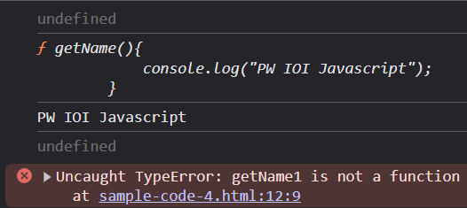


# 🧠 Local Execution Context & Memory Allocation

* Memory is given in the **Local Execution Context** of each function.
* Each function gets its own separate memory space when called.

### Example 5 -> <a href="../javascript-variable-declaration/sample-code-5.html">sample-code-5.html</a>
```javascript
    var x=1;
    a();
    b();
    function a(){
        var x=10;
        console.log(x);
    }
    function b(){
        var x=100;
        console.log(x);
    }

    console.log(x);
```
**Soution:**

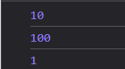

---

# 🔍 Lexical Environment & Scope Chain

**Lexical Environment** = Memory of its container + its parent container

**Scope Chain** 🔗:  It refers to the **chain of lexical environments** used to identify  
the variables | functions to access.


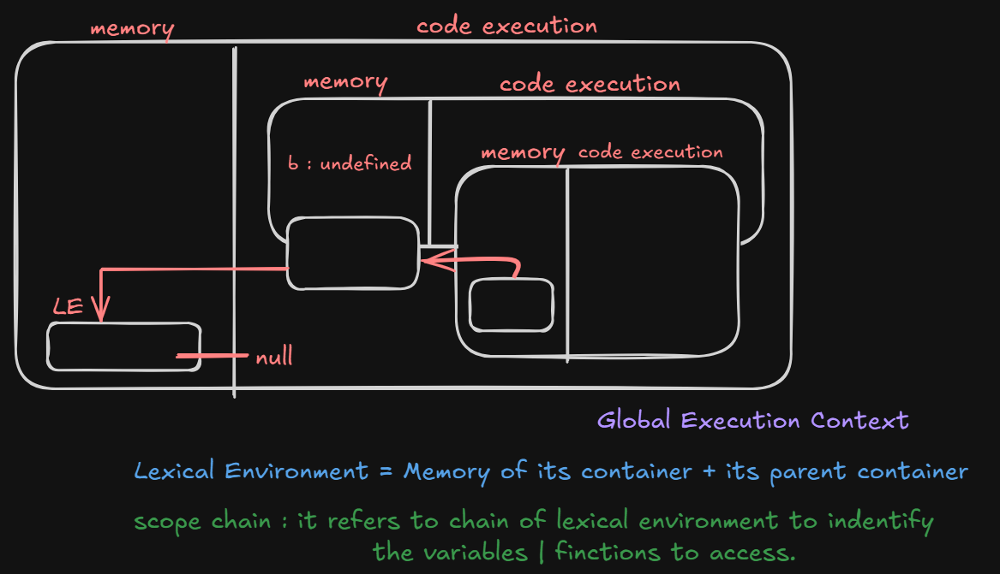

# 🧠 var vs let vs const in JavaScript

### 🔸 var:
- It supports hoisting with `'undefined'` as the result.
- Redeclaring the same variable is possible.
- Reassignment of value to a variable is possible.
- It is a **function scope** variable.
- It supports **shadowing**.

---

### 🔹 let:
- It supports hoisting  
  ➤ [Variable would be in **Temporal Dead Zone**: it can't be used without initializing]
- If we try to use the variable present in the Temporal Dead Zone, it would result in:  
  ⚠️ `ReferenceError: variable can't be accessed without initialization`
- Redeclaring the same variable is **not possible**.
- Reassignment of value to a variable is possible.
- They are **block scope** variables [Can't be used outside the block].
- It supports **shadowing** [Redeclaring the same variable in a different scope].

---

### 🔷 const:
- It supports hoisting  
  ➤ [Variable would be in **Temporal Dead Zone**: it can't be used without initializing]
- Redeclaring the same variable is **not possible**.
- Reassignment of value to a variable is also **not possible**  
  ⚠️ [It results in `TypeError`]
- They are **block scope** variables [Can't be used outside the block].
- It supports **shadowing** [Redeclaring the same variable in a different scope].

## 📊 var vs let vs const – Feature Comparison

| 🔧 Feature                | `var`                             | `let`                                                 | `const`                                                 |
|--------------------------|-----------------------------------|--------------------------------------------------------|----------------------------------------------------------|
| 🌍 Scope                 | Function Scope                    | Block Scope                                            | Block Scope                                              |
| 📦 Hoisting              | Yes (initialized as `undefined`) | Yes (but not initialized)    | Yes (but not initialized)      |
| 🔄 Can be Reassigned     | ✅ Yes                            | ✅ Yes                                                 | ❌ No                                                    |
| 🔁 Can be Redeclared     | ✅ Yes                            | ❌ No                                                  | ❌ No                                                    |
| 🕳️ Temporal Dead Zone   | ❌ No                             | ✅ Yes                                                 | ✅ Yes                                                   |
| 🔁 Use in Loops           | ⚠️ Not safe (due to function scope) | ✅ Safe 👍| ✅ Safe (if no reassignment)|
| 🌐 Global Object Property | ✅ Yes (if declared globally) | ❌ No| ❌ No|

---

## 🧠 Understanding `this`, `window`, and Global Variables in JavaScript

### 🔍 Key Concepts:
- Variables declared with `var` in the global scope are added to the `window` object (in browsers).
- Inside a regular function, `this` refers to the `window` object (when not in strict mode).
- Modifying `window.b` changes the global `b`.

---

### 🧪 Example:
> 💻 **Code**: <a href="../javascript-variable-declaration/scope-environment.html">scope-environment.html</a>
```javascript
var b = 3;

function a() {
    console.log(b);         // 🔸 3 – accesses global variable b
    console.log(this.b);    // 🔸 3 – 'this' refers to window in global context
    console.log(window.b);  // 🔸 3 – direct access via window object

    window.b = 100;         // 🔄 updates global b
}

a();

console.log(b); // 🔸 100 – value of b is updated by window.b
```


## 📝 Variable Naming Rules in JavaScript

1️⃣ Name must start with an **alphabet** or can start with `_` or `$`.

2️⃣ `_` is used for configuring a lot of constructs.  
It often refers to variables that require further implementation.

```javascript
var productName;     // its functionality is final 
var _productName;    // representation :: it is not yet implemented
```
3️⃣❌ Don't use special characters in variable names.
✅ Suggested by ECMA standards.

4️⃣ Name can be **alphanumeric**. `var product2020;`

5️⃣ Name is **case-sensitive.**

6️⃣ Name can be a maximum of **255 characters** long.

7️⃣ Avoid using single-character or overly long variable names.

8️⃣ Avoid using JavaScript **reserved keywords** (There are 45 total).
  ```javascript
    var const; // ❌ invalid
    var if;    // ❌ invalid
  ```
  
9️⃣ Always use camelCase for naming, and it should clearly describe what it is.
  ```javascript
    var u = "sachin";         // ❌ not a good approach
    var userName = "sachin";  // ✅ good approach
  ```

## 🔢📄 JavaScript DataTypes Overview

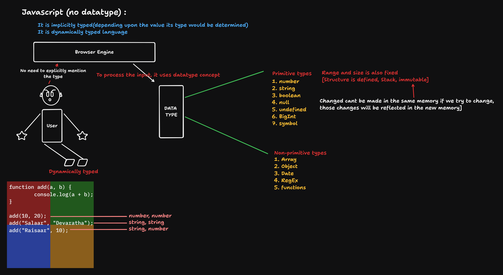

## 🔄 Mutable vs Immutable in JavaScript

### 📌 Key Concepts:
- **Primitive types** like `string` and `number` are **immutable** (can't be changed after creation).
- **Objects** are **mutable** – you can add, modify, or delete their properties.
- Even though primitives can hold properties, those are not retained as primitives don't have memory for object-like behavior.

---

### 🧪 Example Code:
> 💻 **Code**: <a href="../javascript-variable-declaration/mutable-immutable.html">mutable-immutable.html</a>
```javascript
  let str = "Hello";
  ``console.log(str);       // Hello

  str[0] = "Y";
  console.log(str);       // Hello (strings are immutable)

  console.log(typeof str); // string

  let myData = 10;
  myData.id = "Roll_number";
  console.log(myData);    // ❌ 10 (primitives can't store properties)

  let obj = { i: 10 };
  console.log(obj);       // { i: 10 }

  obj.name = "karthikeya";
  console.log(obj);       // { i: 10, name: "karthikeya" }

  obj.id = { country: "IND", type: "cricket" };
  console.log(obj);       // { i: 10, name: "karthikeya", id: { country: "IND", type: "cricket" } }

  console.log(typeof obj); // object

  delete obj.id;
  console.log(obj);       // { i: 10, name: "karthikeya" }
```

> **Note :**<br>
> **Javascript object** = {k : v} convert js object to JSON : **JSON.stringify()** <br>
> **JSON Object** = {k : v} convert string representation to JSON to js object : **JSON.parse()**<br>
>  💻 **JS to JSON Code**:   <a href="../javascript-variable-declaration/json.html">json.html</a>

# 🔢 Number Type in JavaScript

JavaScript stores all numbers (whether typed by the user or written in code) using the **IEEE 754 double-precision floating point format** (64-bit float).

### 🧮 Bit Representation:

| 🧱 Bits  | 🔍 Purpose                            |
|--------|--------------------------------------|
| 1 bit  | Sign (0 = positive, 1 = negative)     |
| 11 bits| Exponent (with bias of 1023)          |
| 52 bits| Mantissa / Fractional digits          |

---

### 📊 JavaScript Number Concepts:

| 🧠 Concept              | 📌 JavaScript (`number`)      |
|------------------------|-----------------------------|
| 🔢 Max Safe Integer     | `2^53 - 1 `                   |
| ⚠️ Precision Above Limit| ❌Lost                        |
| 💡 Alternative          | `BigInt`                    |


### 📝 Note on JavaScript Number Precision

Since `number` is a **floating-point type**, it can lead to **precision issues**.

#### ⚠️ Example:
```javascript
console.log(0.1 + 0.2); // 0.30000000000000004
```

#### ✅ Solution:
```javascript
console.log((0.1 + 0.2).toFixed(2)); // "0.30"
```

---

### 🔢 BigInt

To store any **large integer** number with precision, we use **BigInt**.  
If the number exceeds **53-bit precision**, JavaScript introduces `BigInt`.

```javascript
let c = 9007199254740993n;

console.log(c);             // 9007199254740993
console.log(c == c + 1n);   // false [No loss of precision]
```

---

#### 📌 Example #1

```javascript
let a = 9007199254740991;
let b = 9007199254740992;
let c = 9007199254740993n;
let d = 9007199254740994; 

console.log(a);             // 9007199254740991
console.log(b);             // 9007199254740992
console.log(c);             // 9007199254740993
console.log(d);             // 9007199254740992-it will be 
console.log(c + 1n);        // 9007199254740994n

console.log(a === a + 1);   // true
console.log(c === c + 1n);  // false
```

## 🔄 Converting String to Number in JavaScript

To convert data from **String** format to **Number** type, we have 3 mechanisms:

1️⃣ `parseInt()` | `parseFloat()`  
2️⃣ `Number()`

---

### 🔢 `Number(input)`
- ✅ Expects the input to be strictly in **numeric form**.
- ❌ If **any special characters** are part of the data, it returns `NaN`.


---

#### 🔍 `parseInt(input)`
- ✅ Expects the input in **string** format.
- ✅ Returns the number until it encounters a **non-numeric character**.
- ❌ If the **first character** is a non-numeric/special symbol, it returns `NaN`.


## 🤔 `isNaN(input)` vs `Number.isNaN(input)`

### 🧪 `isNaN(input)`

* Converts the input to **Number** using `Number()` internally.
* If the result is `NaN`, it returns `true`; otherwise, `false`.

📎 **Reference Code**: [isNaN.html](../Inbuit%20methods/isNaN.html)

---

### 🔍 `Number.isNaN(input)` *(ES+6V)*

* **Does not convert** the input.
* It checks **strictly** whether the input is `NaN`.
* Returns `true` if the input is exactly `NaN`; otherwise, `false`.

```javascript
Number.isNaN(NaN);      // true ✅
Number.isNaN("NaN");    // false ❌ (string, not actual NaN)
Number.isNaN(undefined); // false ❌
```

📎 **Reference Code**: [Number_isNaN.html](../Inbuit%20methods/numberIsNaN.html)

> **📝 Note:** While performing `+` operation, if one of the operands is `NaN`, then the output will be `'NaN'`.


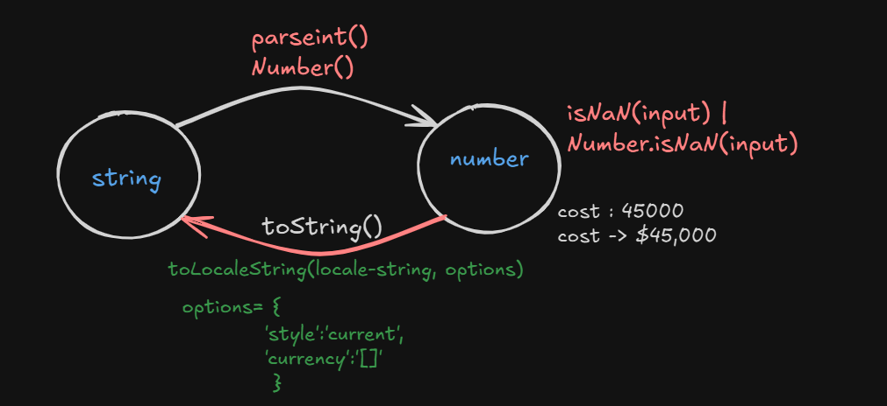

## 🔁 String Conversion Methods

### 🔤 `toString()`

* Converts a number to a **string** representation.

---

### 🌐 `toLocaleString(locale, options)`

* Converts a number into a **localized string** using given **locale** and **formatting options**.

```javascript
options = {
  style: "currency",
  currency: "INR" // or "USD", "EUR", etc.
};
```

✅ Example:
```javascript
let amount = 2500;
console.log(amount.toLocaleString("en-IN", {
  style: "currency",
  currency: "INR"
}));
// Output: ₹2,500.00
```
### 📊 Country, Locale Code & Currency Code

| Country           | Locale Code | Currency Code | Example Amount (45,000) |
|------------------|-------------|----------------|--------------------------|
| United States     | `en-US`     | USD            | 45,000.00                |
| Germany           | `de-DE`     | EUR            | 45.000,00                |
| Japan             | `ja-JP`     | JPY            | ￥45,000                 |
| India             | `en-IN`     | INR            | ₹45,000.00               |
| United Kingdom    | `en-GB`     | GBP            | £45,000.00               |
| Canada            | `en-CA`     | CAD            | CA$45,000.00             |
| Algeria (example) | `ar-DZ`     | DZD            | 45 000,00 DA             |

> 💻 Related Code : 
  [localeString.html](../Inbuit%20methods/localeString.html)

> 🚀 **Mini Project**: [emi-calculator.html](../Inbuit%20methods/emi-calculate.html)

## 🧵 String in JavaScript

In JavaScript, strings can be created in **three ways**:

1️⃣ Double Quotes → `"Hello World"` → used internally by js engine <br>
2️⃣ Single Quotes → `'Hello World'`  <br>
3️⃣ Backticks (Template Literals) → `` `Hello World` `` → used by developers for Template Binding

📝 **Note**:  
Backticks allow **multiline strings** and **expression interpolation** using `${}`.

💻 **Reference Code**: [core-string.html](../Javascript-Strings/core-string.html)

* string uses auto boxing

* length properties 

* Working with backticks

### 🔗 Binding in JavaScript

**Binding** is the process of attaching a variable with its value at runtime.

---

#### 🔄 Data Binding

Binding a variable with its value.

📌 Example:
```javascript
var userName = 'sachin';
document.write(`${userName}`);      // Output: sachin
document.write(`${username}`);      // ❌ ReferenceError (case-sensitive)
```

---

#### 🎨 Style Binding

Attaching style-related details *inline* to an element is called **style binding**.

📌 Examples:
```javascript
document.getElementById("myDiv").style.color = 'red';
document.getElementById("myDiv").style.cssText = 'background: yellow; font-size: 20px;';
```

---

#### 🧷 Class Binding

Attaching a **class** (user-defined or from a library) to an element is called **class binding**.

📌 Example:
```javascript
document.getElementById("myDiv").className = 'myCustomClass';
```

## ⚡ What is an Event?

An **event** is anything that **happens on a webpage**. JavaScript uses these events to trigger actions in response to user interactions.

### 🔍 Common Events

- **🖱️ `onclick`** → Triggered when an element is clicked (e.g., a button).
- **🔄 `onchange`** → Triggered when the value of an input element changes.
- **👀 `onblur`** → Triggered when an element loses focus.
- **🌐 `onload`** → Triggered when the webpage finishes loading in the browser.


## ✍️ String Formatting Methods

JavaScript provides several built-in methods to style or transform strings. These methods return a **new string** and do not modify the original one.

---

| 🛠️ Method            | 🔁 Return Type | 📄 Description                        |
|----------------------|----------------|--------------------------------------|
| `bold()`             | string         | Wraps the string in `<b>` tags.      |
| `italics()`          | string         | Wraps the string in `<i>` tags.      |
| `fontsize(number)`   | string         | Sets font size using `<font size>`.  |
| `fontcolor(string)`  | string         | Sets font color using `<font color>`.|
| `toUpperCase()`      | string         | Converts text to uppercase.          |

---

### 💡 Example

```javascript
let name = "sachin";

document.write(name.bold());          // <b>sachin</b>
document.write(name.italics());       // <i>sachin</i>
document.write(name.fontsize(5));     // <font size="5">sachin</font>
document.write(name.fontcolor("red")); // <font color="red">sachin</font>
document.write(name.toUpperCase());   // SACHIN
```

### 🔗 Method Chaining in JavaScript

**Method Chaining** is the technique of calling multiple methods on the same object in a single line of code.

📌 Example 1:
```javascript
let str = 'string';
let str1 = str.toUpperCase();           // 'STRING'
let str2 = str1.bold();                 // '<b>STRING</b>'
let str3 = str2.fontcolor('red');       // '<font color="red"><b>STRING</b></font>'
document.write(str3);
```

📌 Example 2 (Chained version):
```javascript
document.write(str.toUpperCase().bold().fontcolor('red'));
```

🚀 This makes the code concise and readable when working with string transformations or DOM manipulations.


### ⚠️ JavaScript Error Types

| 🔍 **ReferenceError**                                  | 📐 **SyntaxError**                            | ⚙️ **TypeError**                                  |
|--------------------------------------------------------|------------------------------------------------|---------------------------------------------------|
| a. Not defined<br>b. Undefined<br>c. Cannot access before initialization | Variable is already declared                   | Assignment to a constant variable                 |
| `let` , `const: Temporal Dead Zone`                      | `(let , const)` — redeclaration or invalid syntax | Performing invalid operations on a value, e.g., `null.f()` |


Example 1
> 💻 Related Code : 
  [dark-light.html](../JavaScript-bootstrap/dark-light.html)

Example 2
> 💻 Related Code : 
  [textInput.html](../JavaScript-bootstrap/textInput.html)

## 🧰 Methods of String Object

### 📏 `length` Property
- It counts the number of characters present in the string.
- **Return Type:** `number`

```javascript
let str = "sachin";
console.log(str.length);   // 6 ✅
console.log(str.length()); // ❌ TypeError (length is a property, not a method)
```

> 💻 **Related Code:**   [lettersRemaning.html](../Javascript-Strings/lettersRemaning.html)

---

### 🔍 `startsWith()` & `endsWith()` Methods

**Return Type:**
- **`startsWith(string)`**: `boolean`  
- **`endsWith(string)`**: `boolean`  

#### 📘 Examples

```javascript
let str = 'sachin@gmail.com';
console.log(str.endsWith("@gmail.com")); // true ✅

console.log(str.endsWith("@yahoo.com")); // false ❌

let title = 'IPL2025';
console.log(title.startsWith("IPL"));    // true ✅
console.log(title.startsWith("ipl"));    // false ❌ (case-sensitive)
```

📌 *Note: `startsWith()` and `endsWith()` are case-sensitive methods.*

> 💻 **Related Code:**   [cardATM.html](../Javascript-Strings/cardATM.html)

---

### 🧠 `charAt()` & `charCodeAt()` Methods

These methods are used to work with individual characters in a string.


| 🛠 Method              | 🔁 Return Type   | 📄 Description                                                  |
|------------------------|------------------|------------------------------------------------------------------|
| `charAt(number)`       | `object` (1 char) | Returns the character at the specified index.                    |
| `charCodeAt(number)`   | `object`          | Returns the ASCII/Unicode of the character at the specified index. |


#### 📌 Note:
- ASCII of `a-z` ➡️ `97 to 122`  
- ASCII of `A-Z` ➡️ `65 to 90`  
- If the value passed to `charCodeAt()` is `null`, `undefined`, or `NaN`, it defaults to index `0`.

---

#### 💡 Examples

```javascript
let str = 'sachin';

console.log(str.charAt(0));       
// Output: 's'

console.log(str.charCodeAt(0));   
// Output: 115

console.log(str.charCodeAt());    
// Output: 115 (defaults to index 0 if no argument is passed)
```

> 💻 **Related Code:**   [charCodeAt-index.html](../Javascript-Strings/charCodeAt-index.html)

---

### 🔍 `indexOf()` Method

The `indexOf()` method in JavaScript is used to find the **first occurrence** of a specified substring within a string.


| 🛠 Method       | 🔁 Return Type | 📄 Description                                                                 |
|----------------|----------------|---------------------------------------------------------------------------------|
| `indexOf(str)` | `number`       | Returns the index of the first occurrence of `str`, or `-1` if not found.       |


#### 💡 Example

```javascript
let str = 'hello world';

console.log(str.indexOf('world')); 
// Output: 6

console.log(str.indexOf('xyz'));   
// Output: -1 (not found)
```

> ℹ️ `indexOf()` is **case-sensitive**, so `str.indexOf('World')` would also return `-1`.

> 💻 **Related Code:**   [index-of-index.html](../Javascript-Strings/index-of-index.html)

---

### ✂️ `slice()` Method

The `slice()` method is used to extract characters between specified indices.

#### 🔧 Syntax
```javascript
slice(startIndex, endIndex) : string
```
- Returns characters from `startIndex` up to but **not including** `endIndex`.
- If only `startIndex` is provided, it extracts till the end.
- Extraction is **forward only** (`endIndex` must be greater than `startIndex`).

---

#### 🧾 Parameters

| Parameter     | Description                                                                 |
|---------------|-----------------------------------------------------------------------------|
| `startIndex`  | Required – starting position. Negative values count from the end of string. |
| `endIndex`    | Optional – ending position (exclusive). Negative values also count from end.|

---

#### 🔎 Special Cases

| Value       | Behavior           |
|-------------|--------------------|
| `NaN`       | Treated as `0`     |
| `null`      | Treated as `0`     |
| `undefined` | Interpreted as "till end" |
| `true`      | Treated as `1`     |
| `false`     | Treated as `0`     |

---

#### 💡 Examples

```javascript
let str = 'sachinrameshtendulkar';

console.log(str.slice(6, -5));             // rameshtend
console.log(str.slice(6, 16));             // rameshtend
console.log(str.slice());                  // sachinrameshtendulkar
console.log(str.slice(-6, -9));            // ""
console.log(str.slice(-9, -6));            // ten
console.log(str.slice(NaN, NaN));          // ""
console.log(str.slice(undefined, undefined)); // sachinrameshtendulkar
console.log(str.slice(null, null));        // ""
console.log(str.slice(null, undefined));   // sachinrameshtendulkar
console.log(str.slice(true, true));        // ""
console.log(str.slice(true, false));       // ""
console.log(str.slice(false, true));       // s
console.log(str.slice(false, null));       // ""
console.log(str.slice(false, undefined));  // sachinrameshtendulkar
```

---

### 🔁 `substring()` Method

The `substring()` method extracts characters from a string between two specified indices.

#### 🔧 Syntax
```javascript
substring(startIndex, endIndex) : string
```

- If `endIndex` is omitted → extracts to the end.
- If `startIndex > endIndex` → they are **swapped**.
- **Negative values are treated as 0**.

---

#### 🧾 Parameters

| Parameter     | Description                                                             |
|---------------|-------------------------------------------------------------------------|
| `startIndex`  | Required – Starting position (inclusive).                               |
| `endIndex`    | Optional – Ending position (exclusive). If omitted, reads to the end.   |

---

#### 💡 Examples

```javascript
let str = 'sachinrameshtendulkar';

console.log(str.substring(7));       // 'ameshtendulkar'
console.log(str.substring(7, 15));   // 'ameshten'
console.log(str.substring(7, 0));    // 'sachinr' (start > end → swapped)
```

---

### 🔍 Difference Between `slice()` and `substring()`

| 🧩 **Feature**                             | ✂️ **slice()**                                | 🔁 **substring()**                           |
|--------------------------------------------|------------------------------------------------|----------------------------------------------|
| ✅ **Recommended to Use**                 | ✅ Yes – Preferred in modern JS                | ⚠️ Yes – Older and less intuitive              |
| ➖ **Supports Negative Indices**           | ✅ Yes                                          | ❌ No – Negative treated as 0                 |
| 🔁 **Swaps Indices if `start > end`**     | ❌ No – Returns empty string                   | ✅ Yes – Automatically swaps values           |
| 📏 **Takes Length Instead of endIndex**   | ❌ No – Takes start and end indices            | ❌ No – Takes start and end indices           |

---

### 📘 Methods of String Object

```js
a. toUpperCase()               : string
b. startsWith(string)          : boolean
c. endsWith(string)            : boolean
d. charAt(number)              : string
e. charCodeAt(number)          : number
f. indexOf(string)             : number  // -1 if not found, otherwise returns the index
g. slice([start], [end])       : string
h. substring([start], [end])   : string
```

---

### 🔍 `split()` Method

The `split()` method is used to divide a string into an array of substrings based on a specified delimiter.

```js
console.log(string.split('delimiter'));
console.log(string.split('delimiter', how_many_splits));
```

---

#### ⚠️ Corner Cases

```js
console.log("".split());                            // [""]
console.log("".split(''));                          // []
console.log("sachin".split());                      // ["sachin"]
console.log("sachin,tendulkar".split('', 0));       // []
console.log("hello user".split(undefined));         // ["hello user"]
console.log("sachin,tendulkar".split(undefined, undefined)); // ["sachin,tendulkar"]
console.log("sachin,tendulkar".split(null, true));  // ["sachin,tendulkar"]
console.log("sachin,tendulkar".split(null, false)); // []
console.log("sachin,tendulkar".split(true, null));  // []
console.log("sachin,tendulkar".split(true, true));  // []
console.log("P,W,,".split(','));                    // ["P", "W", "", ""]
console.log("P,W,,I".split(','));                   // ["P", "W", "", "I"]
console.log("P,W,".split(','));                     // ["P", "W", ""]
```


> 💻 Index Code :  [index-of-code.html](../Javascript-Strings/index-of-code.html)

> 💻 Split Code :  [split-code.html](../Javascript-Strings/split-code.html)

> 💻 Split UseCase Code :  [appendChild.html](../Javascript-Strings/appendChild.html)


--- 

### ✂️ `trim()` Method

The `trim()` method is used to remove **leading and trailing white spaces** from a string.

```js
let str = '   sachin ramesh tendulkar  ';
console.log(str, str.length);
// Output: '   sachin ramesh tendulkar  ' 28

let str = '   sachin ramesh tendulkar  ';
console.log(str.length, str.trim(), str.trim().length);
// Output: 28 'sachin ramesh tendulkar' 23
```

---

#### 📝 Note: Conditional Statements with Methods Returning `object|null`

In JavaScript, you can use **condition statements** with methods or properties that return an `object` or `null`.

By default, JavaScript internally uses:
```js
if (someOutput != null) {
    // truthy case
} else {
    // falsy case
}
```

🔍 **Example:**
```js
let str = ''.someMethod(input); // returns Object|null

if (str) {
    // process for true case
} else {
    // process for false case
}
```
#### 📂 Related Concepts:
- `trimStart()` – Removes only leading whitespace
- `trimEnd()` – Removes only trailing whitespace

> 💻 Trim UseCase Code :  [add-reset.html](../Javascript-Strings/add-reset.html)

> 💻 Validation Code :  [validation.html](../Javascript-Strings/validation.html)
