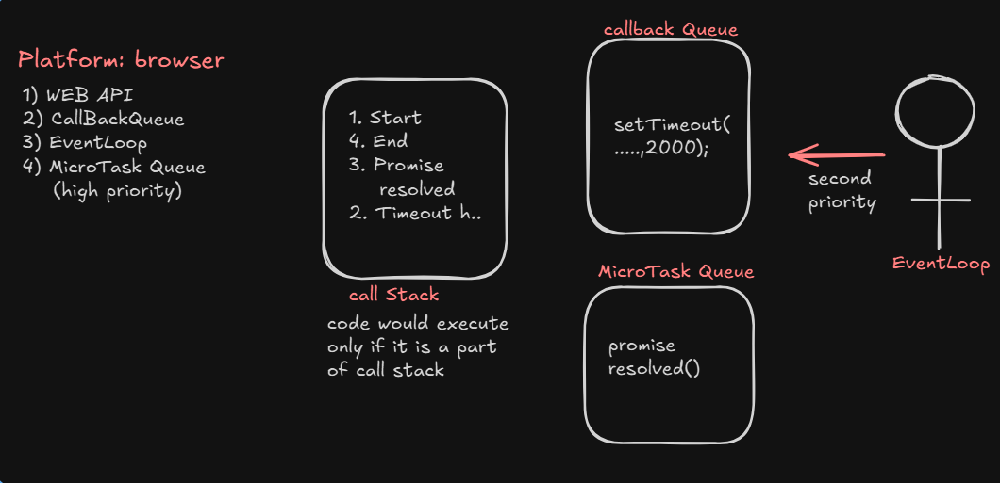
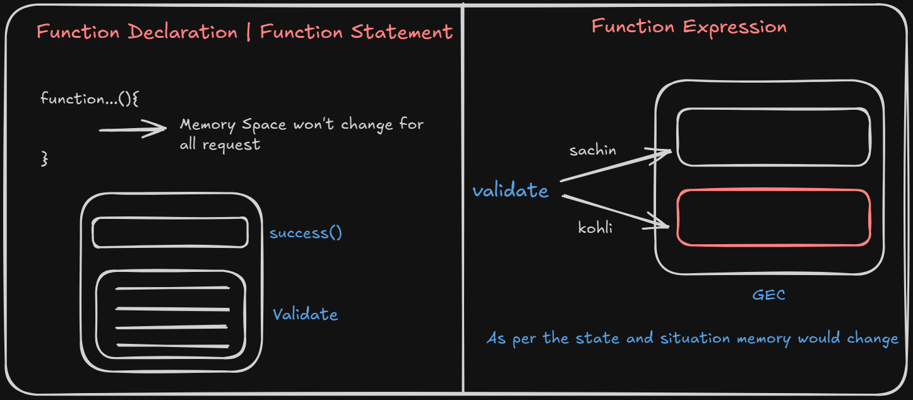

<h1 align="center">⚡️💻 JavaScript 📜✨</h1>

* JavaScript is light weight Interpreted and Just-in-Time Compiled programming language.
* Light weight refers to memory occupied and how heavy the application is.
* Interpreted refers to line by line translation.

## JavaScript as Scripting language (Control flow)


## JavaScript as Programming language (Control flow)


## JavaScript History   


## Characteristics

- **Lightweight**: Refers to the memory usage and the overall "heaviness" of the application.
- **Interpreted**: Code is executed line-by-line.
- **Compiled**: The entire program is translated simultaneously.

## Types of Compilation

1. **JIT (Just-in-Time Compilation)**  
   - JavaScript is loaded into the browser and compiled by the browser.  
   - Happens when the user sends a request.

2. **AOT (Ahead-of-Time Compilation)**  
   - JavaScript is compiled and processed at the application level.  
   - Occurs even before a user request is made.


## Engines and Compilers

JavaScript can be processed using various engines and compilers:

- **Ivy**
- **Babel**
- **Node**
- **V8**


## Programming Paradigms Supported

JavaScript supports a variety of programming techniques:

1. Structural Programming  
2. Functional Programming  
3. Imperative Programming  
4. Object-Oriented Programming (OOP)

> **🔔Note:** JavaScript is **not** a fully object-oriented programming language. It supports only some OOP features.


## 🧩Usage of JavaScript in Project Layers

JavaScript can be used at various levels of a software project:

1. **Client Side**: With HTML
2. **Server Side**: With Node.js
3. **Database**: With MongoDB
4. **Animation Tools**: Flash, 3DS Max, etc.


## Typical Full Stack Setup

```plaintext
Frontend          =>      Backend         =>      Database
 React.js         =>       Node.js        =>       MongoDB          
                           express.js
```

## FAQ

### 1. What are the issues with JavaScript?

JavaScript has several notable limitations:

- **Not strongly typed**: Variables can hold any data type without explicit declaration
  ```javascript
  a = 10;        // number
  a = "sachin";  // string
  a = false;     // boolean
  a = 13.5;      // float
  ```

- **Not strictly typed by default**: Variables can be used without declaration
  ```javascript
  // This works in non-strict mode
  a = 10;
  
  // To enforce stricter behavior:
  "use strict";
  a = 10;  // This would throw an error in strict mode if 'a' is not declared
  ```

- **Inconsistent data structures**: Doesn't enforce uniform object structures
  ```javascript
  [
    {
      Name: "Samsung", 
      price: 45000
    },
    {
      Product: "LG", 
      cost: 55000  // Different property names for similar concepts
    }
  ]
  ```

- **Security concerns**: JavaScript can be blocked by browsers due to security risks
  - Example: Malicious scripts like Trojans that can control devices (bad approach)
  - Legitimate tools like TeamViewer that control devices for installation help (good approach)


# JavaScript – Client Side

The main purpose of JavaScript on the **client side** is to reduce the burden on the server.  
It improves the performance of the application by handling various interactions on the client side.


## Client-Side Interactions

### 1. DOM Manipulation
JavaScript allows dynamic interaction with the Document Object Model (DOM), including:

- Adding elements to the page
- Removing elements from the page
- Updating data within elements
- Dynamically applying styles to elements
- Dynamically configuring events for elements

### 2. Form Validation
JavaScript is commonly used to validate user input before sending data to the server.

### 3. Client Management

- **Memory Management**: For example, storing the username and password in cache memory.
- **Device Interaction**: Managing device-specific tasks, such as printing a ticket without needing an internet connection.
- **Location Management**: Websites can request the user's location using client-side JavaScript.
- **Data Sharing**: Enables sharing of data with other applications on the client device.


> ## How the JavaScript would take control over HTML elements (or) In how many ways we can write the javascript code in HTML page

* **HTML Elements**
  1. Static – Elements that do not change after the page loads.
  2. Dynamic – Elements that change based on user interaction or scripting (JavaScript).

* **Styling**
  * a. Inline – Style written directly inside the element.
    ```html
    <p style="color: blue;">This is an inline styled paragraph.</p>
    ```
  * b. Embedded – CSS written inside `<style>` tags, placed within `<head>` or `<body>` (not outside `<body>`).
    ```html
    <head>
      <style>
        h1 {
          color: green;
        }
      </style>
    </head>
    ```
  * c. External – CSS written in an external file and linked to the HTML using:
    ```html
    <head>
      <link rel="stylesheet" href="styles.css">
    </head>
    ```

* **Dynamic (JavaScript)**
  * a. Inline – Script written directly inside the element using event attributes.
    ```html
    <button onclick="alert('Hello!')">Click Me</button>
    ```
  * b. Embedded – Script written inside `<script>` tags placed within `<head>` or `<body>` (not outside `<body>`).
    ```html
    <head>
      <script>
        function greet() {
          alert("Welcome!");
        }
      </script>
    </head>
    ```
  * c. External – JavaScript written in an external file and linked to the HTML using:
    ```html
    <script src="script.js" type="text/javascript"></script>
    ```

### Window hieracrchy


### Bulk loading


### Specific Function Loading


## JavaScript FAQ

### 1) What is the MIME type for script?
The MIME type for JavaScript is `text/javascript`.

### 2) What is difference between script in head and body?
- **head →** Script would be loaded into browser memory and later used in the page.
- **body →** Script would be loaded directly into the page and it is not a part of browser memory.

### 3) How JavaScript converts Static DOM into Dynamic DOM?
- **HTML →** HTML parser → Static DOM
- **CSS →** CSS parser → Uses static DOM and changes the style of an element using CSSOM.
- **JS →** JavaScript engine → Uses STATIC DOM and converts it into Dynamic DOM using 'events and functions'.
- static then id, dyamiclly loaded means then className, name

### 4) What is strict mode for JavaScript?
Without declaring a variable, if we don't want JavaScript to permit the usage of variables, then we need to use "strict mode".

### 5) How to target JavaScript for Legacy browsers? [Old Version Browsers]
Developer can target new JavaScript code to the legacy browser by enclosing the code in HTML comments.

Syntax:
```html
<script type="text/javascript">
    <!--
        "use strict";
        ...... 
        ......
    -->
</script>
```

### 6) How to link external javascript file to html?
```html
<script src="path-to-file.js">
</script>
```

## JavaScript Properties vs testContent

 

### Text content

 


> #### If we target the element using DOM hieracrchy it might result in code breaks when DOM structure is changed.
**Solution:** use ID and target the element 

> 💻 Related Code :  <a href="../JavaScript examples/dom-hierarchy-code.html">Click on this</a>

### ⚠️ Disadvantage of Using DOM Hierarchy for Targeting Elements

- If we target elements using **DOM hierarchy**, the code might **break** when the DOM structure is altered or changed.


- ✅ Solution : Use **ID** to target the element directly and reliably:
  ```javascript
  document.getElementById("myElement");
  ```


### 🆔 Targeting Elements Using ID Selector

 


- We use the method:
  ```javascript
  const oneElement = document.getElementById('idname');
  ```
- If there are multiple elements with the **same ID**, the method will return only the first matching element.
  ```javascript
  document.getElementById("idname");
  ```

### 🎨 Style Binding to HTML Elements

- To bind a single CSS property to an element:
  ```javascript
  element.style.property = "value";
  ```
- ✅ To set multiple CSS properties in one line:
  ```javascript
  element.style.cssText = "cssKey1: value1; cssKey2: value2;";

  element.style.cssText = "color: blue; background-color: yellow;";
  ```

> 💻 Related Code : 
<a href="../JavaScript examples/using-multiple-id.html">Click on this</a>


## Accessing the Elements in JS

### <u>By ID Name</u>

**document.getElementByTagName() : Element**

 For Code <a href="../JavaScript examples/using-id-code.html">Click on this</a>

### <u>By Class Name</u>

**document.getElementByClassName() : HTMLCollection[]**

* For Code <a href="../JavaScript examples/using-class-code.html">Click on this</a>

* How to convert HTMLCollection to Array?
ans. arrayElements=Array.from(HTMLCollection)

### Working with iterator called "forEach"

* It can be used only on Array object.
```js 
const callbackFunction = (value, index, arr) => {
  // value -> current element
  // index -> index of the current element
  // arr   -> the entire array
};

// Usage
array.forEach(callbackFunction);
```

### 1️⃣ <u>By Tag Name</u>

**document.getElementByTagName() : HTMLCollection[]**

 For Code <a href="../JavaScript examples/using-tag-name.html">Click on this</a>

 Another approach to convert HTMLCollection to Array "[...HTMLCollection]"

### 2️⃣<u>By Name</u>

**document.getElementByName() : NodeList**

 For Code <a href="../JavaScript examples/using-name-code.html">Click on this</a>

 While working with NodeList,directly we an use forEach() without any conversion

### 3️⃣<u>By QuerySelector</u>

 
**document.querySelector(cssSelector) : Element**

**document.querySelectorAll(cssSelector) : NodeList**

 querySelector(cssSelector) | querySelectorAll(cssSelector) to target the element in a HTML page.

 For Code <a href="../JavaScript examples/querySelector-code.html">Click on this</a>

 ### Working with different techniques to access DOM


## FAQ

### 1) Why do we need do many methods to target HTML page using javascript , when we can target directly with single method called 'querySelectorXXX()'?
**Ans.**
Older version of javascript added methods like getElementById( ), getElementByClassName( ), getElementByTagName( ) ,. . . . . . <br>
As css become popular, to give the direct support of accessing the elements using CSS methods like querySelector( ) and querySelectorAll( ) were added.

### 2) Difference between querySelector and getElementBy

> querySelector( ) | querySelectorAll( ) | getElementById( ) ===> works only for static DOM
<br>

>  getElementsByClassName( ) | getElementsByTagName( ) | getElementsByName( ) ===> Dynamic DOM

* For Code <a href="../JavaScript examples/static-dynamic-dom.html">Click on this</a>


**NOTE:**
HTMLCollection is a object first we need to convert to array and we should use it 
```js
elements = document.getElementsByClassName("box");
console.log(typeof elements); // Output: object

Array.from(elements).forEach((value) =>{
        value.style.cssText = "color: red; font-size: 25px; font-weight: bold;";
    })
  
elements.forEach((value) =>{
        value.style.cssText = "color: red; font-size: 25px; font-weight: bold;";
    })

```
## Static vs. Dynamic DOM Access — What's the difference?

### Static DOM Access
* Happens once, at the time of accessing.
* If DOM elements change later, the reference does not update.
* Example: querySelectorAll() returns a NodeList, which is static.


### Dynamic (Live) DOM Access
* Reflects changes automatically.
* If new elements are added or removed, the collection updates itself.
* Example: getElementsByClassName() returns an HTMLCollection, which is live.

### Static vs. Dynamic DOM


### Example:
```html
<div id="container">
  <p class="item">Item 1</p>
  <p class="item">Item 2</p>
</div>

<button onclick="addItem()">Add Item</button>

<script>
  const liveList = document.getElementsByClassName("item"); // Dynamic (live)
  const staticList = document.querySelectorAll(".item");    // Static (snapshot)

  function addItem() {
    const p = document.createElement("p");
    p.className = "item";
    p.textContent = "New Item";
    document.getElementById("container").appendChild(p);

    console.log("Live (HTMLCollection):", liveList.length);   // Updates
    console.log("Static (NodeList):", staticList.length);     // Does not update
  }
</script>
```

# JavaScript Output Techniques

| Method                  | Description |
|--------------------------|-------------|
| `alert()`                | Shows a simple alert message with an OK button. |
| `confirm()`              | Displays a message box with OK and Cancel buttons. Returns a boolean. |
| `document.write()`, `document.writeln()` | Writes directly to the HTML output stream. |
| `innerHTML`, `outerHTML` | Used to get/set HTML content of elements. |
| `innerText`, `outerText` | Used to get/set the visible text of elements. |
| `textContent`            | Retrieves or sets the text content of a node and its descendants. |
| `console.log()`, `console.warn()`, `console.error()`, `console.info()`, `console.debug()` | Used for debugging outputs to the console. |


## JavaScript Output Operations 💬

- 1️⃣ **`alert()`** 🚨  
- 2️⃣ **`confirm()`** ✅❌  
- 3️⃣ **`document.write()` | `document.writeln()`** 📝  
- 4️⃣ **`innerHTML` | `outerHTML`** 🔄  
- 5️⃣ **`innerText` | `outerText`** 📝  
- 6️⃣ **`textContent`** 🖋️  
- 7️⃣ **`console.XXXXX()`** [log(), warn(), error(), info(), debug()] 🖥️


---

### 1️⃣ `alert(msg)` 🚨: `void`
- Displays a message with an "OK" button.
- Returns `undefined` when the user clicks "OK" or presses the "ESC" key.
- Primarily used to display messages.

#### Limitation 🚫
- ❌ No styling can be added to the message.
- ❌ No "Cancel" button, so the user must click "ESC" to exit.

---

### 2️⃣ `confirm(msg)` ✅❌: `boolean`
- Displays a message with "OK" and "Cancel" buttons.
- Returns `true` when the user clicks "OK" and `false` when the user clicks "Cancel".

#### Limitation 🚫
- ❌ No styling can be added to the message.

> 💻 Related Code : 
<a href="../javascript-output-techniques/confirm-code.html">confirm-code.html</a>
---
### 3️⃣ `document.write(msg)` 📝

- Accepts `msg` as a **string** or **HTML elements**.
- Directly writes content into the HTML document.

---

#### Limitation 🚫
- `document.write()` can behave **unexpectedly** if used **after** the page has finished loading — it can overwrite the entire document.


#### ⚙️ Output Behavior of `document.write()`

##### 🔍 What Happens When You Click the Button?

- 🧨 The entire existing page (including the button, heading, etc.) gets **wiped out**.
- Only the content inside `document.write(...)` is displayed.

##### ❓ Why Does This Happen?

- After the page finishes loading, `document.write()` acts like:
  > "Let me 🧹 rebuild the entire document from scratch now!"

> 💻 Related Code : 
<a href="../javascript-output-techniques/document-write-code.html">javascript-output-techniques</a>

### 4️⃣ `innerHTML` vs `outerHTML` 🧱

- **`innerHTML`**: Adds the element as a **child** to the targeted container or element. 👶  
- **`outerHTML`**: **Replaces** the entire targeted element with the newly provided one. 🔁

> 💻 Related Code :  <a href="../javascript-output-techniques/innerHTML-outerHTML.html">javascript-output-techniques</a>

---
### 5️⃣  `innerText` vs `outerText` ✍️

- Works like `innerHTML` and `outerHTML` ✅  
- But only for **text content** — no HTML or styles allowed 🛑
> 💻 Related Code : 
<a href="../javascript-output-techniques/innerText-outerText.html">innerText-outerText.html</a>

---

### 6️⃣ `textContent` 🖋️

- Used to get or set the **text content** of an element.
- Returns all the text within an element, **including text from hidden elements**.
- Does **not parse HTML**—purely works with plain text.
- Ideal when you're working with content programmatically and **don't need styling awareness**.


---

#### 📌 Difference: `innerText` vs `textContent`

- **`textContent`**  
  ✔️ Returns **all text**, including from **hidden elements**  
  ✔️ **Faster** and better for **raw text**  
  ✔️ Ignores CSS layout and visibility  

- **`innerText`**  
  ✔️ Returns only **visible text**  
  ✔️ Respects **CSS visibility** and **layout**  
  ✔️ Includes **line breaks and spacing** as shown on screen  

> ⚠️ Use `textContent` for performance.  
> 🎯 Use `innerText` for accurate, visible representation.

> 💻 Related Code : 
<a href="../javascript-output-techniques/textContent-innerText.html">textContent-innerText.html</a>

---
### 7️⃣🧾 Logs

- Logs refer to the **actions performed by the end user**.  
To **track user behavior or activity**, we use logs in JavaScript (commonly via `console.log()` or other logging tools).


> 💻 Related Code : 
  <a href="../javascript-output-techniques/ConsoleLog-info.html">ConsoleLog-info.html</a>
---


# Javascript input mechanism

a. prompt()  
b. queryString  
c. formelements


## 📥 1. JavaScript `prompt` Behavior
Returns: `string` | `null`

### 🖋️ Description
The `prompt` function shows a dialog box asking the user for input.  
Depending on how the user responds, it returns different values:

---

### 🧠 Behavior Table

| User Action                                   | Result                      |
|-----------------------------------------------|------------------------------|
| ✅ User enters data and clicks **OK**         | `'data'` (string with value) |
| ⚪ User leaves input **empty** and clicks **OK** | `''` (empty string)          |
| ❌ User clicks **Cancel** or presses **ESC**  | `null`                      |

---

✅ **Tip**: Always check if the result is `null` before using the value to avoid errors! 🚀

### **prompt("MSG",[default msg]);**

``` javaScript
prompt("Enter the name", "Enter in UpperCase");
```


## 🌐 2. queryString

It is a combination of **URL + queryParameters (Key, Value)**.

To collect the queryString we use **BOM** (Browser Object Model):  
```javascript
queryString = location.search;
```

QueryString data is received as a **string**.  
String has various methods to process our input:

- a. `slice(start)`
- b. `indexOf('')`

> 💻 Related Code : 
  <a href="../javascript-output-techniques/queryString.html">ConsoleLog-info.html</a>


## Practice Codes

> 💻 BookMyShow Code : 
  <a href="../JavaScript-bootstrap/bookMyShow.html">bookMyShow.html</a>


> 💻 Add Product Code : 
  <a href="../JavaScript-bootstrap/addProduct.html">addProduct.html</a>

# 🚀 How JavaScript Program is Executed (or How JavaScript Runs in the Browser)

* When JavaScript is loaded into the browser's engine, it forms an **Execution Engine** ⚙️  
  Inside the **Execution Context**, there are two main areas:
  1. 🧠 **Memory (Variable Environment)** – stores variables and function declarations
  2. 🔁 **Code Execution (Thread of Execution)** – executes code line by line

### 🖥️ JavaScript in Browser Engine  


* First, a **Global Execution Context (GEC)** is created automatically 🌐  
  Then, whenever a function is invoked, a **new Execution Context** is created and pushed onto the **Call Stack**, as shown below:

### 📦 Execution Context Stack  


---

### 📝 Additional Points:

* JavaScript is **synchronous and single-threaded** 🧵 — it can only execute one command at a time in a specific order.

* The **Call Stack** 📚 keeps track of execution contexts — the one on top is always the currently running context.

* The **Execution Context** is created in two phases:
  1. 🔍 **Memory Creation Phase** – variables and functions are stored in memory (hoisted).
  2. ▶️ **Code Execution Phase** – code runs line by line using the stored memory.

---

> 💻 **Execution Context Code Example**:  
> <a href="../javaScript-flow/executionContext.html">executionContext.html</a>


# Hosting

- Hoisting is a phenomenon in JavaScript where **variables and functions can be used before they are initialized**.
- If a `var` variable holds a **function expression** or an **arrow function**, it **cannot** be used before initialization.
- Trying to do so will result in a **`TypeError`**.

> 🔔 **Note:**  
> ✅ `undefined` is printable.  
> ❌ `null` and `void` are not printable as meaningful output.


### Example 1 -> <a href="../javascript-variable-declaration/sample-code.html">sample-code.html</a>
```javascript
    var x=3;
    function getName(){
        console.log("PW IOI Javascript");
    }
    console.log(x);
    console.log(getName);
    getName();
```
**Soution:**


### Example 2 -> <a href="../javascript-variable-declaration/sample-code-2.html">sample-code-2.html</a>
```javascript
    console.log(x);
    console.log(getName);
    getName();

    var x=3;
    function getName()
    {
        console.log("PW IOI Javascript");
    }
```
**Soution:**


### Example 3 -> <a href="../javascript-variable-declaration/sample-code-3.html">sample-code-3.html</a>
```javascript
    console.log(x);
        console.log(getName);
        getName();
        console.log(getName1);
        getName1();
         
        var x=3;
        function getName(){
            console.log("PW IOI Javascript");
        }

        var getName1=function(){
            console.log("PW IOI React")
        }
        getName1();
```
**Soution:**


### Example 4 -> <a href="../javascript-variable-declaration/sample-code-4.html">sample-code-4.html</a>
```javascript
    console.log(x);
    console.log(getName);
    getName();
    
    console.log(getName2);
    getName2();
    console.log(getName1);
    getName1();
    var x=3;
    function getName(){
        console.log("PW IOI Javascript");
    }

    var getName1=function(){
        console.log("PW IOI React")
    }
    
    var getName2 = () =>{
        console.log("PW IOI Node.js");
    }
```
**Soution:**


# 🧠 Local Execution Context & Memory Allocation

* Memory is given in the **Local Execution Context** of each function.
* Each function gets its own separate memory space when called.

### Example 5 -> <a href="../javascript-variable-declaration/sample-code-5.html">sample-code-5.html</a>
```javascript
    var x=1;
    a();
    b();
    function a(){
        var x=10;
        console.log(x);
    }
    function b(){
        var x=100;
        console.log(x);
    }

    console.log(x);
```
**Soution:**


---

# 🔍 Lexical Environment & Scope Chain

**Lexical Environment** = Memory of its container + its parent container

**Scope Chain** 🔗:  It refers to the **chain of lexical environments** used to identify  
the variables | functions to access.


# 🧠 var vs let vs const in JavaScript

### 🔸 var:
- It supports hoisting with `'undefined'` as the result.
- Redeclaring the same variable is possible.
- Reassignment of value to a variable is possible.
- It is a **function scope** variable.
- It supports **shadowing**.

---

### 🔹 let:
- It supports hoisting  
  ➤ [Variable would be in **Temporal Dead Zone**: it can't be used without initializing]
- If we try to use the variable present in the Temporal Dead Zone, it would result in:  
  ⚠️ `ReferenceError: variable can't be accessed without initialization`
- Redeclaring the same variable is **not possible**.
- Reassignment of value to a variable is possible.
- They are **block scope** variables [Can't be used outside the block].
- It supports **shadowing** [Redeclaring the same variable in a different scope].

---

### 🔷 const:
- It supports hoisting  
  ➤ [Variable would be in **Temporal Dead Zone**: it can't be used without initializing]
- Redeclaring the same variable is **not possible**.
- Reassignment of value to a variable is also **not possible**  
  ⚠️ [It results in `TypeError`]
- They are **block scope** variables [Can't be used outside the block].
- It supports **shadowing** [Redeclaring the same variable in a different scope].

## 📊 var vs let vs const – Feature Comparison

| 🔧 Feature                | `var`                             | `let`                                                 | `const`                                                 |
|--------------------------|-----------------------------------|--------------------------------------------------------|----------------------------------------------------------|
| 🌍 Scope                 | Function Scope                    | Block Scope                                            | Block Scope                                              |
| 📦 Hoisting              | Yes (initialized as `undefined`) | Yes (but not initialized)    | Yes (but not initialized)      |
| 🔄 Can be Reassigned     | ✅ Yes                            | ✅ Yes                                                 | ❌ No                                                    |
| 🔁 Can be Redeclared     | ✅ Yes                            | ❌ No                                                  | ❌ No                                                    |
| 🕳️ Temporal Dead Zone   | ❌ No                             | ✅ Yes                                                 | ✅ Yes                                                   |
| 🔁 Use in Loops           | ⚠️ Not safe (due to function scope) | ✅ Safe 👍| ✅ Safe (if no reassignment)|
| 🌐 Global Object Property | ✅ Yes (if declared globally) | ❌ No| ❌ No|

---

## 🧠 Understanding `this`, `window`, and Global Variables in JavaScript

### 🔍 Key Concepts:
- Variables declared with `var` in the global scope are added to the `window` object (in browsers).
- Inside a regular function, `this` refers to the `window` object (when not in strict mode).
- Modifying `window.b` changes the global `b`.

---

### 🧪 Example:
> 💻 **Code**: <a href="../javascript-variable-declaration/scope-environment.html">scope-environment.html</a>
```javascript
var b = 3;

function a() {
    console.log(b);         // 🔸 3 – accesses global variable b
    console.log(this.b);    // 🔸 3 – 'this' refers to window in global context
    console.log(window.b);  // 🔸 3 – direct access via window object

    window.b = 100;         // 🔄 updates global b
}

a();

console.log(b); // 🔸 100 – value of b is updated by window.b
```


## 📝 Variable Naming Rules in JavaScript

1️⃣ Name must start with an **alphabet** or can start with `_` or `$`.

2️⃣ `_` is used for configuring a lot of constructs.  
It often refers to variables that require further implementation.

```javascript
var productName;     // its functionality is final 
var _productName;    // representation :: it is not yet implemented
```
3️⃣❌ Don't use special characters in variable names.
✅ Suggested by ECMA standards.

4️⃣ Name can be **alphanumeric**. `var product2020;`

5️⃣ Name is **case-sensitive.**

6️⃣ Name can be a maximum of **255 characters** long.

7️⃣ Avoid using single-character or overly long variable names.

8️⃣ Avoid using JavaScript **reserved keywords** (There are 45 total).
  ```javascript
    var const; // ❌ invalid
    var if;    // ❌ invalid
  ```
  
9️⃣ Always use camelCase for naming, and it should clearly describe what it is.
  ```javascript
    var u = "sachin";         // ❌ not a good approach
    var userName = "sachin";  // ✅ good approach
  ```

## 🔢📄 JavaScript DataTypes Overview


## 🔄 Mutable vs Immutable in JavaScript

### 📌 Key Concepts:
- **Primitive types** like `string` and `number` are **immutable** (can't be changed after creation).
- **Objects** are **mutable** – you can add, modify, or delete their properties.
- Even though primitives can hold properties, those are not retained as primitives don't have memory for object-like behavior.

---

### 🧪 Example Code:
> 💻 **Code**: <a href="../javascript-variable-declaration/mutable-immutable.html">mutable-immutable.html</a>
```javascript
  let str = "Hello";
  ``console.log(str);       // Hello

  str[0] = "Y";
  console.log(str);       // Hello (strings are immutable)

  console.log(typeof str); // string

  let myData = 10;
  myData.id = "Roll_number";
  console.log(myData);    // ❌ 10 (primitives can't store properties)

  let obj = { i: 10 };
  console.log(obj);       // { i: 10 }

  obj.name = "karthikeya";
  console.log(obj);       // { i: 10, name: "karthikeya" }

  obj.id = { country: "IND", type: "cricket" };
  console.log(obj);       // { i: 10, name: "karthikeya", id: { country: "IND", type: "cricket" } }

  console.log(typeof obj); // object

  delete obj.id;
  console.log(obj);       // { i: 10, name: "karthikeya" }
```

> **Note :**<br>
> **Javascript object** = {k : v} convert js object to JSON : **JSON.stringify()** <br>
> **JSON Object** = {k : v} convert string representation to JSON to js object : **JSON.parse()**<br>
>  💻 **JS to JSON Code**:   <a href="../javascript-variable-declaration/json.html">json.html</a>

# 🔢 Number Type in JavaScript

JavaScript stores all numbers (whether typed by the user or written in code) using the **IEEE 754 double-precision floating point format** (64-bit float).

### 🧮 Bit Representation:

| 🧱 Bits  | 🔍 Purpose                            |
|--------|--------------------------------------|
| 1 bit  | Sign (0 = positive, 1 = negative)     |
| 11 bits| Exponent (with bias of 1023)          |
| 52 bits| Mantissa / Fractional digits          |

---

### 📊 JavaScript Number Concepts:

| 🧠 Concept              | 📌 JavaScript (`number`)      |
|------------------------|-----------------------------|
| 🔢 Max Safe Integer     | `2^53 - 1 `                   |
| ⚠️ Precision Above Limit| ❌Lost                        |
| 💡 Alternative          | `BigInt`                    |


### 📝 Note on JavaScript Number Precision

Since `number` is a **floating-point type**, it can lead to **precision issues**.

#### ⚠️ Example:
```javascript
console.log(0.1 + 0.2); // 0.30000000000000004
```

#### ✅ Solution:
```javascript
console.log((0.1 + 0.2).toFixed(2)); // "0.30"
```

---

### 🔢 BigInt

To store any **large integer** number with precision, we use **BigInt**.  
If the number exceeds **53-bit precision**, JavaScript introduces `BigInt`.

```javascript
let c = 9007199254740993n;

console.log(c);             // 9007199254740993
console.log(c == c + 1n);   // false [No loss of precision]
```

---

#### 📌 Example #1

```javascript
let a = 9007199254740991;
let b = 9007199254740992;
let c = 9007199254740993n;
let d = 9007199254740994; 

console.log(a);             // 9007199254740991
console.log(b);             // 9007199254740992
console.log(c);             // 9007199254740993
console.log(d);             // 9007199254740992-it will be 
console.log(c + 1n);        // 9007199254740994n

console.log(a === a + 1);   // true
console.log(c === c + 1n);  // false
```

## 🔄 Converting String to Number in JavaScript

To convert data from **String** format to **Number** type, we have 3 mechanisms:

1️⃣ `parseInt()` | `parseFloat()`  
2️⃣ `Number()`

---

### 🔢 `Number(input)`
- ✅ Expects the input to be strictly in **numeric form**.
- ❌ If **any special characters** are part of the data, it returns `NaN`.


---

#### 🔍 `parseInt(input)`
- ✅ Expects the input in **string** format.
- ✅ Returns the number until it encounters a **non-numeric character**.
- ❌ If the **first character** is a non-numeric/special symbol, it returns `NaN`.


## 🤔 `isNaN(input)` vs `Number.isNaN(input)`

### 🧪 `isNaN(input)`

* Converts the input to **Number** using `Number()` internally.
* If the result is `NaN`, it returns `true`; otherwise, `false`.

📎 **Reference Code**: [isNaN.html](../Inbuit%20methods/isNaN.html)

---

### 🔍 `Number.isNaN(input)` *(ES+6V)*

* **Does not convert** the input.
* It checks **strictly** whether the input is `NaN`.
* Returns `true` if the input is exactly `NaN`; otherwise, `false`.

```javascript
Number.isNaN(NaN);      // true ✅
Number.isNaN("NaN");    // false ❌ (string, not actual NaN)
Number.isNaN(undefined); // false ❌
```

📎 **Reference Code**: [Number_isNaN.html](../Inbuit%20methods/numberIsNaN.html)

> **📝 Note:** While performing `+` operation, if one of the operands is `NaN`, then the output will be `'NaN'`.


## 🔁 String Conversion Methods

### 🔤 `toString()`

* Converts a number to a **string** representation.

---

### 🌐 `toLocaleString(locale, options)`

* Converts a number into a **localized string** using given **locale** and **formatting options**.

```javascript
options = {
  style: "currency",
  currency: "INR" // or "USD", "EUR", etc.
};
```

✅ Example:
```javascript
let amount = 2500;
console.log(amount.toLocaleString("en-IN", {
  style: "currency",
  currency: "INR"
}));
// Output: ₹2,500.00
```
### 📊 Country, Locale Code & Currency Code

| Country           | Locale Code | Currency Code | Example Amount (45,000) |
|------------------|-------------|----------------|--------------------------|
| United States     | `en-US`     | USD            | 45,000.00                |
| Germany           | `de-DE`     | EUR            | 45.000,00                |
| Japan             | `ja-JP`     | JPY            | ￥45,000                 |
| India             | `en-IN`     | INR            | ₹45,000.00               |
| United Kingdom    | `en-GB`     | GBP            | £45,000.00               |
| Canada            | `en-CA`     | CAD            | CA$45,000.00             |
| Algeria (example) | `ar-DZ`     | DZD            | 45 000,00 DA             |

> 💻 Related Code : 
  [localeString.html](../Inbuit%20methods/localeString.html)

> 🚀 **Mini Project**: [emi-calculator.html](../Inbuit%20methods/emi-calculate.html)

## 🧵 String in JavaScript

In JavaScript, strings can be created in **three ways**:

1️⃣ Double Quotes → `"Hello World"` → used internally by js engine <br>
2️⃣ Single Quotes → `'Hello World'`  <br>
3️⃣ Backticks (Template Literals) → `` `Hello World` `` → used by developers for Template Binding

📝 **Note**:  
Backticks allow **multiline strings** and **expression interpolation** using `${}`.

💻 **Reference Code**: [core-string.html](../Javascript-Strings/core-string.html)

* string uses auto boxing

* length properties 

* Working with backticks

### 🔗 Binding in JavaScript

**Binding** is the process of attaching a variable with its value at runtime.

---

#### 🔄 Data Binding

Binding a variable with its value.

📌 Example:
```javascript
var userName = 'sachin';
document.write(`${userName}`);      // Output: sachin
document.write(`${username}`);      // ❌ ReferenceError (case-sensitive)
```

---

#### 🎨 Style Binding

Attaching style-related details *inline* to an element is called **style binding**.

📌 Examples:
```javascript
document.getElementById("myDiv").style.color = 'red';
document.getElementById("myDiv").style.cssText = 'background: yellow; font-size: 20px;';
```

---

#### 🧷 Class Binding

Attaching a **class** (user-defined or from a library) to an element is called **class binding**.

📌 Example:
```javascript
document.getElementById("myDiv").className = 'myCustomClass';
```

## ⚡ What is an Event?

An **event** is anything that **happens on a webpage**. JavaScript uses these events to trigger actions in response to user interactions.

### 🔍 Common Events

- **🖱️ `onclick`** → Triggered when an element is clicked (e.g., a button).
- **🔄 `onchange`** → Triggered when the value of an input element changes.
- **👀 `onblur`** → Triggered when an element loses focus.
- **🌐 `onload`** → Triggered when the webpage finishes loading in the browser.

# Strings

## ✍️ String Formatting Methods

JavaScript provides several built-in methods to style or transform strings. These methods return a **new string** and do not modify the original one.

---

| 🛠️ Method            | 🔁 Return Type | 📄 Description                        |
|----------------------|----------------|--------------------------------------|
| `bold()`             | string         | Wraps the string in `<b>` tags.      |
| `italics()`          | string         | Wraps the string in `<i>` tags.      |
| `fontsize(number)`   | string         | Sets font size using `<font size>`.  |
| `fontcolor(string)`  | string         | Sets font color using `<font color>`.|
| `toUpperCase()`      | string         | Converts text to uppercase.          |

---

### 💡 Example

```javascript
let name = "sachin";

document.write(name.bold());          // <b>sachin</b>
document.write(name.italics());       // <i>sachin</i>
document.write(name.fontsize(5));     // <font size="5">sachin</font>
document.write(name.fontcolor("red")); // <font color="red">sachin</font>
document.write(name.toUpperCase());   // SACHIN
```

### 🔗 Method Chaining in JavaScript

**Method Chaining** is the technique of calling multiple methods on the same object in a single line of code.

📌 Example 1:
```javascript
let str = 'string';
let str1 = str.toUpperCase();           // 'STRING'
let str2 = str1.bold();                 // '<b>STRING</b>'
let str3 = str2.fontcolor('red');       // '<font color="red"><b>STRING</b></font>'
document.write(str3);
```

📌 Example 2 (Chained version):
```javascript
document.write(str.toUpperCase().bold().fontcolor('red'));
```

🚀 This makes the code concise and readable when working with string transformations or DOM manipulations.


### ⚠️ JavaScript Error Types

| 🔍 **ReferenceError**                                  | 📐 **SyntaxError**                            | ⚙️ **TypeError**                                  |
|--------------------------------------------------------|------------------------------------------------|---------------------------------------------------|
| a. Not defined<br>b. Undefined<br>c. Cannot access before initialization | Variable is already declared                   | Assignment to a constant variable                 |
| `let` , `const: Temporal Dead Zone`                      | `(let , const)` — redeclaration or invalid syntax | Performing invalid operations on a value, e.g., `null.f()` |


Example 1
> 💻 Related Code : 
  [dark-light.html](../JavaScript-bootstrap/dark-light.html)

Example 2
> 💻 Related Code : 
  [textInput.html](../JavaScript-bootstrap/textInput.html)

## 🧰 Methods of String Object

### 📏 `length` Property
- It counts the number of characters present in the string.
- **Return Type:** `number`

```javascript
let str = "sachin";
console.log(str.length);   // 6 ✅
console.log(str.length()); // ❌ TypeError (length is a property, not a method)
```

> 💻 **Related Code:**   [lettersRemaning.html](../Javascript-Strings/lettersRemaning.html)

---

### 🔍 `startsWith()` & `endsWith()` Methods

**Return Type:**
- **`startsWith(string)`**: `boolean`  
- **`endsWith(string)`**: `boolean`  

#### 📘 Examples

```javascript
let str = 'sachin@gmail.com';
console.log(str.endsWith("@gmail.com")); // true ✅

console.log(str.endsWith("@yahoo.com")); // false ❌

let title = 'IPL2025';
console.log(title.startsWith("IPL"));    // true ✅
console.log(title.startsWith("ipl"));    // false ❌ (case-sensitive)
```

📌 *Note: `startsWith()` and `endsWith()` are case-sensitive methods.*

> 💻 **Related Code:**   [cardATM.html](../Javascript-Strings/cardATM.html)

---

### 🧠 `charAt()` & `charCodeAt()` Methods

These methods are used to work with individual characters in a string.


| 🛠 Method              | 🔁 Return Type   | 📄 Description                                                  |
|------------------------|------------------|------------------------------------------------------------------|
| `charAt(number)`       | `object` (1 char) | Returns the character at the specified index.                    |
| `charCodeAt(number)`   | `object`          | Returns the ASCII/Unicode of the character at the specified index. |


#### 📌 Note:
- ASCII of `a-z` ➡️ `97 to 122`  
- ASCII of `A-Z` ➡️ `65 to 90`  
- If the value passed to `charCodeAt()` is `null`, `undefined`, or `NaN`, it defaults to index `0`.

---

#### 💡 Examples

```javascript
let str = 'sachin';

console.log(str.charAt(0));       
// Output: 's'

console.log(str.charCodeAt(0));   
// Output: 115

console.log(str.charCodeAt());    
// Output: 115 (defaults to index 0 if no argument is passed)
```

> 💻 **Related Code:**   [charCodeAt-index.html](../Javascript-Strings/charCodeAt-index.html)

---

### 🔍 `indexOf()` Method

The `indexOf()` method in JavaScript is used to find the **first occurrence** of a specified substring within a string.


| 🛠 Method       | 🔁 Return Type | 📄 Description                                                                 |
|----------------|----------------|---------------------------------------------------------------------------------|
| `indexOf(str)` | `number`       | Returns the index of the first occurrence of `str`, or `-1` if not found.       |


#### 💡 Example

```javascript
let str = 'hello world';

console.log(str.indexOf('world')); 
// Output: 6

console.log(str.indexOf('xyz'));   
// Output: -1 (not found)
```

> ℹ️ `indexOf()` is **case-sensitive**, so `str.indexOf('World')` would also return `-1`.

> 💻 **Related Code:**   [index-of-index.html](../Javascript-Strings/index-of-index.html)

---

### ✂️ `slice()` Method

The `slice()` method is used to extract characters between specified indices.

#### 🔧 Syntax
```javascript
slice(startIndex, endIndex) : string
```
- Returns characters from `startIndex` up to but **not including** `endIndex`.
- If only `startIndex` is provided, it extracts till the end.
- Extraction is **forward only** (`endIndex` must be greater than `startIndex`).

---

#### 🧾 Parameters

| Parameter     | Description                                                                 |
|---------------|-----------------------------------------------------------------------------|
| `startIndex`  | Required – starting position. Negative values count from the end of string. |
| `endIndex`    | Optional – ending position (exclusive). Negative values also count from end.|

---

#### 🔎 Special Cases

| Value       | Behavior           |
|-------------|--------------------|
| `NaN`       | Treated as `0`     |
| `null`      | Treated as `0`     |
| `undefined` | Interpreted as "till end" |
| `true`      | Treated as `1`     |
| `false`     | Treated as `0`     |

---

#### 💡 Examples

```javascript
let str = 'sachinrameshtendulkar';

console.log(str.slice(6, -5));             // rameshtend
console.log(str.slice(6, 16));             // rameshtend
console.log(str.slice());                  // sachinrameshtendulkar
console.log(str.slice(-6, -9));            // ""
console.log(str.slice(-9, -6));            // ten
console.log(str.slice(NaN, NaN));          // ""
console.log(str.slice(undefined, undefined)); // sachinrameshtendulkar
console.log(str.slice(null, null));        // ""
console.log(str.slice(null, undefined));   // sachinrameshtendulkar
console.log(str.slice(true, true));        // ""
console.log(str.slice(true, false));       // ""
console.log(str.slice(false, true));       // s
console.log(str.slice(false, null));       // ""
console.log(str.slice(false, undefined));  // sachinrameshtendulkar
```

---

### 🔁 `substring()` Method

The `substring()` method extracts characters from a string between two specified indices.

#### 🔧 Syntax
```javascript
substring(startIndex, endIndex) : string
```

- If `endIndex` is omitted → extracts to the end.
- If `startIndex > endIndex` → they are **swapped**.
- **Negative values are treated as 0**.

---

#### 🧾 Parameters

| Parameter     | Description                                                             |
|---------------|-------------------------------------------------------------------------|
| `startIndex`  | Required – Starting position (inclusive).                               |
| `endIndex`    | Optional – Ending position (exclusive). If omitted, reads to the end.   |

---

#### 💡 Examples

```javascript
let str = 'sachinrameshtendulkar';

console.log(str.substring(7));       // 'ameshtendulkar'
console.log(str.substring(7, 15));   // 'ameshten'
console.log(str.substring(7, 0));    // 'sachinr' (start > end → swapped)
```

---

### 🔍 Difference Between `slice()` and `substring()`

| 🧩 **Feature**                             | ✂️ **slice()**                                | 🔁 **substring()**                           |
|--------------------------------------------|------------------------------------------------|----------------------------------------------|
| ✅ **Recommended to Use**                 | ✅ Yes – Preferred in modern JS                | ⚠️ Yes – Older and less intuitive              |
| ➖ **Supports Negative Indices**           | ✅ Yes                                          | ❌ No – Negative treated as 0                 |
| 🔁 **Swaps Indices if `start > end`**     | ❌ No – Returns empty string                   | ✅ Yes – Automatically swaps values           |
| 📏 **Takes Length Instead of endIndex**   | ❌ No – Takes start and end indices            | ❌ No – Takes start and end indices           |

---

### 📘 Methods of String Object

```js
a. toUpperCase()               : string
b. startsWith(string)          : boolean
c. endsWith(string)            : boolean
d. charAt(number)              : string
e. charCodeAt(number)          : number
f. indexOf(string)             : number  // -1 if not found, otherwise returns the index
g. slice([start], [end])       : string
h. substring([start], [end])   : string
```

---

### 🔍 `split()` Method

The `split()` method is used to divide a string into an array of substrings based on a specified delimiter.

```js
console.log(string.split('delimiter'));
console.log(string.split('delimiter', how_many_splits));
```

---

#### ⚠️ Corner Cases

```js
console.log("".split());                            // [""]
console.log("".split(''));                          // []
console.log("sachin".split());                      // ["sachin"]
console.log("sachin,tendulkar".split('', 0));       // []
console.log("hello user".split(undefined));         // ["hello user"]
console.log("sachin,tendulkar".split(undefined, undefined)); // ["sachin,tendulkar"]
console.log("sachin,tendulkar".split(null, true));  // ["sachin,tendulkar"]
console.log("sachin,tendulkar".split(null, false)); // []
console.log("sachin,tendulkar".split(true, null));  // []
console.log("sachin,tendulkar".split(true, true));  // ["sachin,tendulkar"]
console.log("P,W,,".split(','));                    // ["P", "W", "", ""]
console.log("P,W,,I".split(','));                   // ["P", "W", "", "I"]
console.log("P,W,".split(','));                     // ["P", "W", ""]
```


> 💻 Index Code :  [index-of-code.html](../Javascript-Strings/index-of-code.html)

> 💻 Split Code :  [split-code.html](../Javascript-Strings/split-code.html)

> 💻 Split UseCase Code :  [appendChild.html](../Javascript-Strings/appendChild.html)


--- 

### ✂️ `trim()` Method

The `trim()` method is used to remove **leading and trailing white spaces** from a string.

```js
let str = '   sachin ramesh tendulkar  ';
console.log(str, str.length);
// Output: '   sachin ramesh tendulkar  ' 28

let str = '   sachin ramesh tendulkar  ';
console.log(str.length, str.trim(), str.trim().length);
// Output: 28 'sachin ramesh tendulkar' 23
```

---

#### 📝 Note: Conditional Statements with Methods Returning `object|null`

In JavaScript, you can use **condition statements** with methods or properties that return an `object` or `null`.

By default, JavaScript internally uses:
```js
if (someOutput != null) {
    // truthy case
} else {
    // falsy case
}
```

🔍 **Example:**
```js
let str = ''.someMethod(input); // returns Object|null

if (str) {
    // process for true case
} else {
    // process for false case
}
```
#### 📂 Related Concepts:
- `trimStart()` – Removes only leading whitespace
- `trimEnd()` – Removes only trailing whitespace

> 💻 Trim UseCase Code :  [add-reset.html](../Javascript-Strings/add-reset.html)

> 💻 Validation Code :  [validation.html](../Javascript-Strings/validation.html)

### 🔍 `match(regEx)` Method

The `match()` method in JavaScript is used to retrieve the result of matching a string against a **regular expression**.

**Syntax:**
```javascript
string.match(regEx)
```

**Return Type:** `Array | null`  
- If a match is found → returns a non-empty array of matched values.
- If no match is found → returns `null`.

---

### 📌 Example Usages:

```javascript
let str = '9998887776';
let matchInput = /^\d{10}$/;
console.log(str.match(matchInput)); 
// ✅ Matches entire 10-digit number → returns non-empty array

let str = '999888777';
let matchInput = /^\d{10}$/;
console.log(str.match(matchInput)); 
// ❌ Doesn't match exactly 10 digits → returns null

let str = '9998887776';
let matchInput = /\d{10}/;
console.log(str.match(matchInput)); 
// ✅ Matches 10 digits anywhere in the string → returns match

let str = '999888777';
let matchInput = /\d{10}/;
console.log(str.match(matchInput)); 
// ❌ Only 9 digits → returns null

let str = '9998887776778';
let matchInput = /\d{10}/;
console.log(str.match(matchInput)); 
// ✅ Finds a 10-digit sequence within a longer string → returns match
```

---

### ✅ Recommended Practice

To ensure **exact match** from start to end of the string, always use `^` and `$` anchors:

- `^` → Matches the beginning of the string.
- `$` → Matches the end of the string.

```javascript
let str = '9998887776';
let matchInput = /^\d{10}$/;
console.log(str.match(matchInput)); 
// Ensures the full string is exactly 10 digits long
```

> **Note:** If you do not use `^` and `$`, the regex will **partially match** substrings within the input rather than the entire string.

```javascript
let str = '9998887776778';
let matchInput = /\d{10}/;
console.log(str.match(matchInput)); 
// Finds and returns the first 10-digit match even though the full string is longer
```
# Boolean

## ✅ Boolean Type in JavaScript

In JavaScript, the **boolean** type has only two possible values:
- `true`
- `false`

### 🔢 Other values treated as Boolean:
- Any **non-zero number** (positive or negative): `true`
- **Zero (`0`)**: `false`

### 📌 Examples:
```javascript
console.log(Boolean(true));    // true
console.log(Boolean(false));   // false
console.log(Boolean(10));      // true
console.log(Boolean(-5));      // true
console.log(Boolean(0));       // false
```

---

### ✅ Common HTML Attributes That Behave Like Boolean

Certain attributes in HTML act like boolean flags — their mere presence implies `true`, and absence implies `false`.

### 📋 List of Boolean Attributes:

| Attribute   | Description                                      |
|-------------|--------------------------------------------------|
| `checked`   | Used in `<input>` (type checkbox/radio) to show it is selected |
| `readonly`  | Makes an input field non-editable                |
| `required`  | Specifies that the input must be filled out before submitting |
| `disabled`  | Disables an element                              |
| `border`    | (On `<table>` or ``) Indicates if border should be shown |

> ⚠️ `border` is not a standard boolean attribute like others, but behaves similarly in older HTML specifications (e.g., `<table border>`). Modern practice recommends using CSS instead.

## ➕ How `+` Operator Works in JavaScript

The `+` operator behaves differently based on the types of its operands:

### 🧠 Behavior:

- **If both operands are numbers:** Performs **Addition**
- **If one operand is a string:** Performs **Concatenation**
- **If one operand is a number and the other is boolean/null/undefined:** Converts to number and performs **Addition**

---

### 📌 Examples:

```javascript
console.log(5 + 10);             // 15 (number)
console.log(3.5 + 2.5);          // 6 (number)
console.log(-1 + 4);             // 3 (number)
console.log("3" + 2);            // "32" (string)
console.log(2 + "3");            // "23" (string)
console.log("5" + true);         // "5true" (string)
console.log(10 + "5");           // "105" (string)
console.log("5" + 10);           // "510" (string)
console.log("Result: " + 5 + 10);  // "Result: 510"
console.log(5 + 10 + " is the result"); // "15 is the result"
```

---

## ❓ Ternary Operator

### 📌 Syntax:
```javascript
condition ? value_if_true : value_if_false;
```

### 📌 Example:
```javascript
let age = 20;
let access = (age >= 18) ? "Allowed" : "Denied";
console.log(access); // "Allowed"
```

# 🧠 Decision Making Operators and Statements

## 🔁 Comparison Operators

| Operator | Description               |
|----------|---------------------------|
| `==`     | Equal                     |
| `===`    | Identical Equal           |
| `!=`     | Not Equal                 |
| `!==`    | Identical Not Equal       |
| `>`      | Greater than              |
| `<`      | Lesser than               |
| `>=`     | Greater than or equal     |
| `<=`     | Less than or equal        |
| `&&`     | Logical AND               |
| `||`     | Logical OR                |
| `!`      | Logical NOT               |

---

## ❓ FAQ

### Q1: What is the difference between `==` and `===`?
**A:**  
- `==` compares **values**, and **performs type conversion** if necessary.  
- `===` compares **both values and types** strictly — **no type conversion**.

#### ✅ Example:
```javascript
2 == '2'   // true  => Number('2') becomes 2
2 === '2'  // false => number !== string
```

---

### Q2: How to compare a value with a regular expression?

**A:**  
Use the `.match()` method of strings.

```javascript
let mobile = "+91987654210";
let regExp = /\+91\d{10}/;

mobile == regExp        // ❌ Invalid
mobile === regExp       // ❌ Invalid
mobile.match(regExp)    // ✅ Valid
```

---

### Q3: How to convert string `"true"` to boolean `true`?

**A:**
Use a comparison:

```javascript
let boolType = 'true' === 'true' ? true : false;
console.log(boolType, typeof(boolType)); // true 'boolean'
```


## 🔤 String Methods
| Method           | Description                                 | Return Type |
|------------------|---------------------------------------------|-------------|
| `toLowerCase()`  | Converts all characters to lowercase         | `string`    |
| `toUpperCase()`  | Converts all characters to uppercase         | `string`    |
| `slice()`        | Extracts part of a string                    | `string`    |
| `indexOf()`      | Returns index of first match or -1           | `number`    |
| `split()`        | Splits string into an array by delimiter     | `array`     |
| `trim()`         | Removes leading and trailing spaces          | `string`    |
| `substring()`    | Extracts characters between indices          | `string`    |
| `charAt()`       | Returns character at specified index         | `string`    |
| `charCodeAt()`   | Returns ASCII code of character              | `number`    |
| `match()`        | Returns array if match with regex else null  | `array|null`|

---

## 🧮 Operators

- **Ternary Operator:**  
  ```js
  condition ? trueValue : falseValue
  ```

- **Arithmetic Operator:**
  - `+` → Adds or concatenates based on data type

- **Comparison Operators:**
  - `==` → Loose equality (type conversion allowed)
  - `===` → Strict equality (no type conversion)

---

## 📑 Statements
> Executable code that determines the **control flow** of the program.

---

## 🔀 Conditional Statements

| Type              | Syntax Example |
|-------------------|----------------|
| `if`              | `if (condition) { ... }` |
| `if else`         | `if (condition) { ... } else { ... }` |
| `nested if else`  | `if (a) { if (b) { ... } else { ... } }` |
| `switch`          |  
```js
switch(value) {
  case 1: break;
  case 2: break;
  default: break;
}
```

---

### ✅ Condition

```js
if (condition) {
  // true part
}
```

- `condition` must result in `true` or `false`


> 💻 If Code :  [if-1.html](../Condition-Statements/if-1.html)

> Example to demonstrate if else logic as code driven


> 💻 If-2 Code :  [if-2.html](../Condition-Statements/if-2.html)


## 🔁 if-else

An `if-else` statement allows control flow based on a condition.  
If the condition evaluates to `true`, the `if` block executes.  
If it evaluates to `false`, the `else` block executes.

### 🔹 Syntax
```js
if (condition) {
  // true block
} else {
  // false block
}
```

- `else` has **no condition**—it runs **only when the `if` condition fails**.


> 💻 Validate Card Code :  [validateCard.html](../Condition-Statements/validateCard.html)


---

## 🔀 Nested if-else

Nested `if-else` refers to using one `if` statement **inside another**.  
It allows **multiple conditions** to be checked in a hierarchical order.

### 🔹 Syntax
```js
if (condition1) {
  if (condition2) {
    if (condition3) {
      // logic when all conditions are true
    } else {
      // condition3 is false
    }
  } else {
    // condition2 is false
  }
} else {
  // condition1 is false
}
```

- Use nesting **carefully** to avoid deeply nested logic (which becomes hard to read).


> 💻 nested-if-else Code :  [nested-if-else.html](../Condition-Statements/nested-if-else  .html)


## 🔸 JavaScript Output Techniques

| Method               | Description                                           |
|----------------------|-------------------------------------------------------|
| `alert(string)`      | Pops up a message box with an OK button               |
| `confirm(string)`    | Shows a dialog box with OK and Cancel (returns boolean) |
| `document.write()`   | Writes directly to the HTML document                  |
| `innerHTML`          | Modifies content (including HTML) of an element       |
| `textContent`        | Inserts plain text (ignores HTML tags)                |
| `innerText` / `outerText` | Reads/changes visible content (inner only or full element) |

---

## 🔹 JavaScript Input

| Method      | Description                        |
|-------------|------------------------------------|
| `prompt()`  | Shows input box and returns `string|null` |

---

## 🎯 JavaScript DOM Targeting

| Technique                      | Description                         |
|--------------------------------|-------------------------------------|
| `getElementById()`             | Select by ID (static)               |
| `getElementsByClassName()`     | Select by class (dynamic)           |
| `getElementsByTagName()`       | Select by tag (dynamic)             |
| `querySelector()`              | Modern CSS-based selector (single)  |
| `querySelectorAll()`           | Modern CSS-based selector (all)     |

---

## 📦 Primitive Types

- Stored in **Stack Memory (LIFO)**
- **Fixed size**
- **Immutable**: Cannot change original memory location.

### a. Number
- IEEE 754 (64-bit floating point)
- `Number()`, `parseInt()`, `parseFloat()`
- Methods: `.toString()`, `.toLocaleString(locale, formatOptions)`

### b. String
- Property: `.length`
- Methods: `slice()`, `trim()`, `split()`, `substring()`, `match()`, `charCodeAt()`, `indexOf()`

### c. Boolean
- `true` / `false`
- Falsy: `0`, `""`, `null`, `undefined`, `NaN`, `-0`, `0n`
- Truthy: non-zero numbers, `" "`, `"sachin"`, `[]`, `{}`, `function(){}`

### d. Null
- Runtime placeholder for empty value

### e. Undefined
- Default uninitialized state (compile-time by JS engine)

### f. BigInt
- For very large integers (suffix `n`)

### g. Symbol
- Unique and immutable primitive

---

### ⚖️ Equality and Type Checks

| Expression             | Result     |
|------------------------|------------|
| `null === null`        | `true`     |
| `undefined === undefined` | `true` |
| `NaN === NaN`          | `false`    |
| `NaN == NaN`           | `false`    |
| `null == undefined`    | `true`     |
| `null === undefined`   | `false`    |

---

## 🔗 Logical Operators

| Syntax                            | Description                    |
|-----------------------------------|--------------------------------|
| `(condition1) && (condition2)`    | AND: Both must be true         |
| `(condition1) \|\| (condition2)`  | OR: At least one must be true  |

---

## 🧮 Programs

### 🔸 a. Largest of 2 Numbers
```js
if (a > b) {
  console.log("a is greater");
} else {
  console.log("b is greater");
}
```

### 🔸 b. Largest of 3 Numbers
```js
if (a > b && a > c) {
  console.log("a is greatest");
} else if (b > c) {
  console.log("b is greatest");
} else {
  console.log("c is greatest");
}
```

### 🔸 c. Check if value is within range
```js
function inRange(value, min, max) {
  return value >= min && value <= max;
}
```

### 🔸 d. Triangle Type
```js
if (a === b && b === c) {
  console.log("Equilateral");
} else if (a === b || b === c || a === c) {
  console.log("Isosceles");
} else {
  console.log("Scalene");
}
```

---

## 🔁 Switch in JavaScript

Used when comparing one input (`type`) against multiple predefined values.

### 🔹 Syntax
```js
switch(type) {
  case label1:
    // statements
    break;

  case label2:
    // statements
    break;

  default:
    // fallback
    break;
}
```

---

### 🧠 Important Notes on Switch

1. Comparison is **strict**: `type === label`
2. `default` block is optional and can appear **anywhere**
3. `break` prevents **fall through**
4. If `break` is omitted, **next case also runs**
5. You can **intentionally allow fall-through** by not using `break`
6. Only **one** `default` is allowed
7. **Duplicate cases** are valid
8. `case` labels can be of **any type** (boolean, string, object, etc.)

---

### ❓ FAQ

1. ✅ Can we define switch without default? — Yes  
2. ✅ Can default be placed anywhere? — Yes  
3. ✅ Can we omit `break` in a case? — Yes, but leads to fall-through  
4. ✅ Can we use `return` instead of `break`? — Yes, inside a function  
5. 🔄 `break` vs `return` — `break` exits switch, `return` exits function  
6. ✅ Case values as `"string"` or `true`? — Yes  
7. ✅ Multiple cases for one block? — Yes (fall-through mechanism)  
8. ❌ Case with a range? — Not directly, use `if-else` instead

```js
switch (true) {
  case (marks >= 90):
    console.log("A grade");
    break;
  case (marks >= 75):
    console.log("B grade");
    break;
  default:
    console.log("Needs improvement");
}
```

> 💻 switch Code :  [switch.html](../Condition-Statements/switch.html)


## ✅ JavaScript Condition Evaluation: Truthy vs Falsy

In JavaScript, conditionals like `if (condition)` evaluate the **truthiness** or **falsiness** of the value.


### ❌ Falsy Values

The following values are considered **falsy**, meaning they evaluate to `false` in a conditional statement:

1. `0`
2. `""` (empty string)
3. `null`
4. `undefined`
5. `NaN`
6. `-0`
7. `0n` (BigInt zero)

```javascript
if (0) console.log("This won't run");
if ("") console.log("This won't run");
if (null) console.log("This won't run");
```

---

### ✅ Truthy Values

The following values are considered **truthy**, meaning they evaluate to `true` in a conditional statement:

1. Any **non-zero number** (positive or negative)  
2. Any **non-empty string**, including `" "` (a space) or `"sachin"`  
3. **Arrays** `[]` and **objects** `{}` (even if empty)  
4. **Functions** like `function() {}`  

```javascript
if (42) console.log("Truthy!");
if ("sachin") console.log("Truthy!");
if ([]) console.log("Truthy!");
if ({}) console.log("Truthy!");
```

--- 

✅ *Remember: JavaScript treats empty values, zeros, and undefined-like values as falsy — everything else is truthy!*

## JavaScript Falsy Condition Trick

```js
let a = null;
if (a | "" | undefined | NaN) {
  console.log(true);
} else {
  console.log(false);  // Output: true
}
```

### Explanation
- The bitwise OR `|` operator **does not check truthiness**, it performs **bitwise operations** on numbers.
- `null | "" | undefined | NaN` converts all values to numbers:
  - `null → 0`
  - `"" → 0`
  - `undefined → NaN`
  - `NaN → NaN`
- Bitwise OR of any number with NaN gives `0 | 0 | NaN | NaN → 0`
- `if(0)` is falsy, so this **should return false**, but JS may behave unexpectedly due to the bitwise conversions.

---

## Tricky JavaScript Comparisons

### a. NaN Comparison

```js
console.log(NaN == NaN);    // false
console.log(NaN === NaN);   // false
```

### Explanation:
- `NaN` is **never equal to itself**, even with strict equality.
- To check for `NaN`, use `Number.isNaN()` or `isNaN()`.

---

## null vs undefined

```js
if (null == undefined) {
  console.log("hello");   // Output: hello
} else {
  console.log("hey");
}
```

### Explanation:
- `null == undefined` is **true** (loose equality).
- `null === undefined` is **false** (strict equality).


### Notes
- Uses strict equality (`===`)
- `break` avoids fall-through
- `default` is optional, can be placed anywhere
- Multiple cases can share same block

---

## Non-Primitive Data Types

### Characteristics
- Stored in Heap
- Mutable
- No predefined size or structure

### Examples
- `Array`
- `Object`
- `Map`
- `function(){}`

# Array

It is used to store multiple values under a single variable name.  
Memory allocation need not be **contiguous** as data is stored in the form of **Key-Value** pairs,  
and accessed using the **key (index)**.

## Creation Phase

```js
let arr1 = new Array(size);           // Dynamic array
let arr2 = [value1, value2, ...];     // Static array
```

## Notes

- Arrays can hold any data type (primitive or non-primitive).
- Indexing happens internally as **strings** (since JavaScript treats all object keys as strings).
- Arrays can be created in two ways:
  1. **Static**: `let arr = [val1, val2, ...]`
  2. **Dynamic**: `let arr = new Array(size)`

## Different Ways to Read Elements from an Array

### a. Using `for` loop (traditional index-based)

```js
for (let i = 0; i < array.length; i++) {
  console.log(array[i]);
}
```

### b. Using `for...in` (reads keys/indexes)

```js
for (const index in array) {
  console.log(array[index]);
}
```

### c. Using `for...of` (reads values directly)

```js
for (const element of array) {
  console.log(element);
}
```


///--notes pending


4/06

## Rest Operator in javascript

Q) What is the rest operator(...)?
ans. the rest operator is a sysntax in javasript written as three dots ... used to collect multiple elements into a single array. 

It's like saying: "Gather all the remaining elements into this variables"

--pending

## Array methods for inserting the elements

Array.push(...items) : number -> It would insert the element at the end of an array
Array.unshif(..items) : number -> It would insert the element at the begining of an array


---remaining


## Array methods for deletion 

Array.pop() : string | undefined
Array.shift() : string | undefined


## sorting the elements in an array
Arrays.sort(compareFuction) : []


-->> notes pending
-----------------------------------
5/06/2025

## 🔍 `filter()` Method in JavaScript

The `filter()` method creates a **new array** with elements that **pass a test** provided by a callback function.

### 📌 Syntax:
```javascript
array.filter(callback(element, index, array));
```

- **callback**: Function to test each element.
- **element**: Current element being processed.
- **index** *(optional)*: Index of the current element.
- **array** *(optional)*: The array `filter()` was called on.

---

### ⚡ Example:
```javascript
let numbers = [1, 2, 3, 4, 5];
let evenNumbers = numbers.filter(num => num % 2 === 0);
// let evenNumbers=numbers.filter(function (num){
//   return num % 2 === 0;
// })
console.log(evenNumbers); // Output: [2, 4]
```

---

### ✅ Arrow Function Rules (with `filter()` or otherwise)

1. ❌ Do **not** use the `function` keyword.
2. ✅ If there is **only one parameter**, you can omit `()`:
   ```javascript
   x => x * x;
   ```
3. ✅ If there's **only one statement**, you can omit `{}`:
   ```javascript
   arr.filter(x => x > 5);
   ```
4. ❌ Do **not** use the `return` keyword if the body is a single expression:
   ```javascript
   arr.filter(x => x % 2 === 0);
   ```


💡 *Use `filter()` when you need a subset of elements that satisfy a specific condition from an array.*

## 🔄 `reduce()` Method in JavaScript

The `reduce()` method **reduces** an array to a **single value** by applying a function to each element and accumulating the result.


### 📌 Syntax:
```javascript
array.reduce(callback(accumulator, currentValue, index, array), initialValue);
```

- **accumulator**: Accumulates the result from each callback execution.
- **currentValue**: The current element being processed.
- **index** *(optional)*: Index of the current element.
- **array** *(optional)*: The array `reduce()` was called on.
- **initialValue** *(optional)*: A value to use as the first argument to the first call of the callback.

---

### ⚡ Example:
```javascript
let numbers = [1, 2, 3, 4, 5];
let sum = numbers.reduce((acc, curr) => acc + curr, 0);
console.log(sum); // Output: 15
```


💡 *Use `reduce()` when you need to derive a single value from an array — such as a sum, average, max, min, or even a new object or array.*


Java : mehtods (logic)

json :properties(Data)

synatx: {
  'K':'V'
}
key should be of string type
value can be anytype 

using obj[key]
if the key is a variable or a computed value.
of the key is invalid as an identifer,

--notes pending

----------------------------------------------------------

## Rules for Writing Arrow Functions

- **Don't** use `function` keyword.
- If **only one parameter**, parentheses `()` are **optional**.
- If **only one statement** in the function body, `{}` are **optional**.
- For single return statements, the `return` keyword is **implicit** (when using concise body).

---

## `reduce()`
Reduces the array to a single value by applying a function to each element and accumulating the result.

**Syntax:**
```js
array.reduce(callback(accumulator, currentValue, index, array), initialValue);
```
- **accumulator**: accumulates the result
- **currentValue**: current element being processed
- **initialValue**: optional value to start the accumulation

**Example 1:**
```js
let num = [1, 2, 3, 4];
let answer = num.reduce(function(total, data) {
  console.log(total, data);
  return total + data;
}, 0);
console.log(answer);
```

> 💻 reduce Code :  [reduce.html](../Arrays/reduce.html)


---

### Example: Cart Total Calculation
```js
let cart = [
  { id: 1, name: 'Laptop', price: 50000, available: true },
  { id: 2, name: 'Mouse', price: 500, available: false },
  { id: 3, name: 'Keyboard', price: 1000, available: true },
  { id: 4, name: 'Monitor', price: 8000, available: false },
  { id: 5, name: 'USB Cable', price: 200, available: true }
];

let availableItems = cart.filter(item => item.available === true);
let totalCost = availableItems.reduce(function(total, item) {
  return total + item.price;
}, 0);
console.log(totalCost);
```

### Compact Code Version:
```js
let amountToBePaid = cart.filter(item => item.available)
  .reduce((total, obj) => total + obj.price, 0);
console.log(amountToBePaid);
```

---

### IPL Teams Frequency Count:
```js
let iplTeams = ["CSK", "MI", "CSK", "MI", "SRH", "RCB", "KKR", "KKR", "MI", "CSK"];
let result = iplTeams.reduce(function(obj, team) {
  obj[team] = (obj[team] || 0) + 1;
  return obj;
}, {});
console.log(result);  // { CSK: 3, MI: 3, SRH: 1, RCB: 1, KKR: 2 }
```

---

# Object vs JSON

## Object
- Consists of:
  - **Properties** (data)
  - **Methods** (functions)
- Syntax:
```js
{
  "key": value
}
```
- Key: always string (internally converted)
- Value: can be number, string, array, object, boolean, function

## Reading JSON/Object Data
```js
product.key           // dot notation
product["key"]        // bracket notation
```

### When to Use:
- `obj.key`: known, valid identifiers
- `obj["key"]`: dynamic, invalid or computed keys

```js
const weirdObj = { "first-name": "sachin", "123": "number" };
console.log(weirdObj["first-name"]);  // sachin
console.log(weirdObj["123"]);         // number
```

---

## Example: User Object 

> 💻 Json Code :  [setTimeout.html](../JSON-obj/index.html)

## Fetching JSON


**Syntax:**
```js
fetch("path/to/file.json")
  .then(function(response) {
    return response.json();
  })
  .then(function(user) {
    console.log(user);
  })
  .catch(function(error) {
    console.error(error);
  });
```

**Example JSON File: `/data/user-data.json`**
```json
{
  "userName": "sachin",
  "age": 51,
  "teams": ["MI", "CSK"],
  "records": {
    "Centuries": 100,
    "average": 53.5,
    "Brand": "MRF"
  },
  "isMarried": true
}
```

**HTML Script:**
```js
<script>
  const URL = '../data/user-data.json';

  fetch(URL)
    .then(function(response) {
      return response.json();
    })
    .then(function(user) {
      console.log(user);
    })
    .catch(function(error) {
      console.log(error);
    });
</script>
```

# Execution Flow of JavaScript Code by the Engine

JavaScript is a **single-threaded** and **synchronous** programming language by nature.

## JavaScript Components Used During Asynchronous Operations

1. **Call Stack**
2. **Web APIs / Browser APIs**  
   - `setTimeout()`, `fetch()`, DOM Events, etc.
3. **Callback Queue**  
   - Also called Task Queue or Message Queue
4. **Event Loop**
5. **Microtask Queue**  
   - Includes promises and `queueMicrotask()` callbacks

---

## Flow of Execution

### 1. Call Stack
- The **main thread** runs here.
- JavaScript executes **line by line** synchronously.
- Functions are pushed onto and popped off the stack as they are called and returned.

### 2. Web APIs
- Provided by the browser, **not JavaScript** itself.
- Handles asynchronous operations like:
  - Timers (`setTimeout`, `setInterval`)
  - AJAX (`fetch`)
  - DOM events
- Once completed, they send their **callback functions** to the Callback Queue.

### 3. Callback Queue
- Stores callbacks from Web APIs.
- Functions in this queue are **waiting to enter** the Call Stack.
- A function can enter the stack **only when the Call Stack is empty**.

### 4. Event Loop
- Acts as a **traffic controller**.
- Constantly **checks** if:
  - The Call Stack is empty.
  - If yes, it moves the first function from the **Microtask Queue** (if any) or Callback Queue into the stack.

### 5. Microtask Queue
- Contains **higher priority** tasks than the Callback Queue.
- Mostly consists of:
  - `.then()` and `.catch()` blocks from Promises
  - `queueMicrotask()` callbacks
- **Always executed before** any task from the Callback Queue once the Call Stack is empty.

---

### Summary

> Microtasks > Macrotasks (callbacks)  
> Event Loop ensures that the Call Stack always gets cleared tasks **in the correct priority order**.





> 💻 setTimeout Code :  [setTimeout.html](../JSON-obj/setTimeout.html)

# JavaScript Execution: A Chef's Analogy

## Synchronous (Single-threaded)
- Imagine **one chef** in a restaurant.
- The chef:
  - Starts cooking **one dish**.
  - **Finishes and serves** it.
  - Then moves to the **next dish**.
- Every task (dish) must **wait for the previous one to finish**.
- 🔁 Sequential, **one at a time**.

> 🧑‍🍳 "Cook → Serve → Repeat"

---

## Asynchronous (with Web APIs, Event Loop)
- Same **one chef**, but smarter and more efficient.
- The chef:
  - Starts **multiple dishes**.
  - For ones that take time (like baking), he **sets a timer** and puts it in the **oven** (like a Web API).
  - Moves on to other tasks while waiting.
  - When a dish is ready, the oven (Web API) **notifies** the chef (via Callback Queue).
  - The chef serves it **when he’s not busy** (Call Stack is empty).

> 🧑‍🍳 "Start multiple dishes → Timer for each → Serve when ready"

### Key Takeaway
- Synchronous = **Step-by-step**, wait for each task.
- Asynchronous = **Non-blocking**, tasks can be handled **when ready** without halting the main flow.


> 💻 cooking Code :  [cooking.html](../JSON-obj/cooking.html)

# JavaScript Asynchronous Execution - Restaurant Analogy

## Core Components

| Component         | Analogy                                |
|------------------|-----------------------------------------|
| **Call Stack**    | 👨‍🍳 Chef (executes code one by one)     |
| **Web API**       | 🧑‍🍽️ Waiter (handles timers, fetch, etc.) |
| **Callback Queue**| 🍽️ Kitchen (chef sets timer here)        |
| **Event Loop**    | 🧑‍💼 Manager (decides when chef is free)  |
| **Microtask Queue**| 🎯 VIP customers (priority for manager)  |

---

## What is `setTimeout()`?

- `setTimeout()` is a **Web API function** used to **delay execution** of a function.
- It is **asynchronous** and **non-blocking**.

### Syntax

```javascript
setTimeout(callbackFunction, delayInMilliseconds, arg1, arg2, ...);
```

### Example

```javascript
let id = setTimeout(function (name) {
    console.log(`Hello : ${name}`);
}, 2000, 'sachin');

console.log(id);
clearTimeout(id);
```

### Notes

- **Purpose:** Run a function after a delay.
- **Async/Sync:** Asynchronous (via Web API).
- **Blocks Execution?** No.
- **Use Cases:** Delay, retry, simulate timeouts, UI updates.
- **Cancel It?** Yes, using `clearTimeout(timerID)`.

---

## What is a Promise?

A **Promise** is like a **commitment** — something you request now that may be **fulfilled** (success) or **rejected** (failure) in the future.

### Syntax

```javascript
let action = new Promise(function(resolve, reject) {
    // async code
    let result = ''; // Example: API call
    if(result) {
        resolve();
    } else {
        reject();
    }
});
```

### Consuming the Promise

```javascript
action
    .then(function(output) {
        // handle success
    })
    .catch(function(error) {
        // handle error
    });
```

> Promises help manage asynchronous operations and provide cleaner alternatives to deeply nested callbacks.


> 💻 promise Code :  [promise-code.html](../JSON-obj/promise-code.html)

## What is `async` and `await`?

`async` and `await` are syntactic sugar over Promises, making asynchronous code easier to read and write without chaining `.then()` and `.catch()`.


### Explanation

- **`async`**: Marks a function to run asynchronously and always returns a **Promise**.
- **`await`**: Pauses the execution of the `async` function until the **Promise** is resolved or rejected.

---

### Syntax

```javascript
function somePromise() {
    return new Promise(function(resolve, reject) {
        // logic
    });
}

async function processLogic() {
    try {
        let msg = await somePromise();
        // use msg for processing
    } catch(error) {
        // handle error
    }
}

processLogic();
```

---

### Summary

| Keyword | Purpose |
|---------|---------|
| `async` | Declares that the function will run asynchronously and return a promise. |
| `await` | Waits for the promise to resolve/reject before moving on. |

> `async/await` makes asynchronous JavaScript code look and behave a little more like synchronous code.

> 💻 async Code :  [async.html](../JSON-obj/async.html)

> **Note:**  
> By default, all the Web APIs are **Browser APIs** that the JavaScript engine can use with the help of the `window` object.


### Examples

* 💻 api-rendring-code  :  [api-rendring-code.html](../JSON-obj/api-rendring-code.html)


* 💻 api-rendering-asynch-await Code :  [api-rendering-asynch-await.html](../JSON-obj/api-rendering-asynch-await.html)


## FAQs

```js
const user = {
    "name": "Karthikeya",
    "age": 19,
    isMarried: true
}
```


### 1) How to read all the keys from object?  
**Ans:** `Object.keys(obj)` returns an array of strings.

```js
Object.keys(user).forEach((key) => {
    console.log(key);
})
```

> 💻 key-rendering-code: [key-rendering-code.html](../JSON-obj/key-rendering-code)

---

### 2) How to know the datatype of a key?

```js
Object.keys(user).forEach((key) => {
    console.log(`${key}------>${user[key]}----->${typeof user[key]}`);
})
```

> 💻 dataType-code: [dataType.html](../JSON-obj/dataType.html)

---

### 3) How to get the count of keys in an Object?  
**Ans:** Use the `length` property.

```js
Object.keys(user).length;
```

---

### 4) How to read both keys and values in an Object?  
**Ans:**

```js
Object.keys(user).forEach((key) => {
    console.log(`${key}------>${user[key]}`);
})
```

---

### 5) How to remove a key dynamically?  
**Ans:** `delete user.age;`

This would delete the key from the object, so the number of keys associated with that object would be reduced.

> 💻 deleteKey-code: [deleteKey.html](../JSON-obj/deleteKey.html)

---

### 6) How to check availability of a key in Object?  
**Ans:** Using `in` operator.

```js
if (key in obj) {
    // key is a part of the object
} else {
    // key is not a part of the object
}
```

---

### 7) How to retrieve the values from an object?  
**Ans:** `Object.values(obj)` returns an array.

```js
Object.values(user); // returns [ "Karthikeya", 19, true ]
```

### 8) How to retrive both key and values from an Object?
**Ans:** `Object.entries(obj) : [[K,V],......]`


>💻 FAQ-code  :  [FAQ.html](../JSON-obj/FAQ.html)

## Object holding the methods

**Property**: holds data  
**Methods**: control the data

**Note:**  
In the case of an object, if we are writing a function as a value to the key, then to access the properties of the object inside the function, we need to use the `this` keyword.  

This rule does **not** apply if we are using an **arrow function** as the value to the property.


>💻 object-code  :  [FAQ.html](../JSON-obj/objectcode.html)

### API Codes

>💻 mars-rover-api-code  :  [mars-rover-api-code.html](../JSON-obj/mars-rover-api-code.html)

>💻 fake-api-products-code  :  [fake-api-products-code.html](../JSON-obj/fake-api-products-code.html)

>💻 fake-api-card-code  :  [fake-api-card.html](../JSON-obj/fake-api-card.html)


### `findIndex((value, index, array))` : Returns the index of the first element that satisfies the condition

#### Example:

```js
let users = [
  { id: 10, name: 'sachin' },
  { id: 18, name: 'kohli' }
];

let index = users.findIndex(user => user.id === 18);
console.log(index); // 1

index = users.findIndex(user => user.id === 7);
console.log(index); // -1
```
## Shopping Cart 
> 💻 shopping-code  :  [shopping.html](../JavaScript-bootstrap/shopping.html) 

## Map, Date, Function?

### 1. What are the limitations of Object?
- Key must be of string type.
- No standard API on its own to tell the number of keys present in an object.
- Searching and deletion on its own can't be done; it must be done with the help of operators.
- Best suited when data is structured, otherwise it would fail.

---

### MAP

**Syntax:**  
```js
var refName = new Map();
```

Map provides the following methods for manipulation:

- `set()` → Assign a new key with value.  
- `get()` → Access a value with reference of key.  
- `keys()` → Returns all keys.  
- `values()` → Returns all values.  
- `entries()` → Returns all keys and values.  
- `delete()` → Removes a key and value.  
- `has()` → Checks the availability of any key.  
- `clear()` → Removes all keys.  
- `size` → Returns the total count of keys.

**Note:** Use `for...of` to iterate if we have data in Map type.


> 💻 map-code  :  [map.html](../Non-primitive/map.html) 

> 💻 map-array-code  :  [map-array.html](../Non-primitive/map-array.html) 

## Symbol Type

### What is "Symbol" type in JavaScript?

**Ans:** It is a **primitive datatype** in JavaScript.

- It is used for **unique identification** of any element in an object.
- It configures a **hidden key**, which can be used individually but is **ignored in iterations** like `for...in`, `Object.keys()`, etc.

---

### How to configure a Symbol

```js
var ID = Symbol();
```

---

### Define key with Symbol type in an Object

```js
const user = {
  [ID]: 101,
  name: "Karthikeya"
};
```

---

### Access the Symbol key individually

```js
console.log(user[ID]); // 101
```

> Note: Symbols are not enumerable and won't appear in regular object iterations.

> 💻 symbol-type-code  :  [symbol-type.html](../Non-primitive/symbol-type.html) 

### eg2:

- We can create a `Symbol()` type with the same key.

- Even if we create a `Symbol()` type with the same key, still **2 different objects** would be available in memory.

- If we use the `==` or `===` operator on `Symbol()` types with the same key, the result would be **false**.

- We can use `toString()` on a `Symbol()` to convert it into a string type while rendering on the UI.


## DATE

- Date type is defined by using JavaScript "Date()" constructor.
- It allocates memory for storing date type value.
- Date type is stored in "Year-Month-Day" format.
- It can handle both date and time values.

### Syntax:

```js
// Loads the current system date and time
var departure = new Date();

// Creates a date with a specific date and time
var departus = new Date("YYYY-MM-DD HH:MM:SS.Milliseconds");

// Creates a date with a specific date (time will be set to 00:00:00)
var mfd = new Date("YYYY-MM-DD");
```

### JavaScript Date Object Methods (as Table)

| Method              | Description                                           | Range/Example                        |
|---------------------|-------------------------------------------------------|--------------------------------------|
| `getHours()`        | Returns the hour                                      | 0 to 23                              |
| `getMinutes()`      | Returns the minutes                                   | 0 to 59                              |
| `getSeconds()`      | Returns the seconds                                   | 0 to 59                              |
| `getMilliseconds()` | Returns the milliseconds                              | 0 to 999                             |
| `getDay()`          | Returns the day of the week                           | 0 (Sunday) to 6 (Saturday)           |
| `getDate()`         | Returns the day of the month                          | 1 to 31                              |
| `getMonth()`        | Returns the month                                     | 0 (January) to 11 (December)         |
| `getFullYear()`     | Returns the 4-digit year                              | e.g., 2025                           |
| `getYear()`         | **Obsolete**: Returns year - 1900 as per Y2K                    | e.g., 125 for year 2025              |


### Conversion of output as per the user requriements
 
- toLocaleDateString()
- toLocaleTimeString()
- toString()

> 💻 date-code  :  [date.html](../Non-primitive/date.html)

> 💻 dateDiffFormate-code  :  [dateDiffFormate.html](../Non-primitive/dateDiffFormate.html)


## setTimeout(callbackfunction, timerinms, args)

a. Function inside the setTimeout forms a closure and remembers reference to `i`.
b. Wherever function goes it takes the reference of `i` along with it.
c. `console.log("*************")` executes first. It will not wait for the setTimeout function.

```js
<script type="text/javascript">
function x(){
var i=10;
console.log("*****************")
setTimeout(function(){
console.log(i)
},3000);
console.log("******************")
}
x();
</script>
```

**Output**
```
*****************
******************
10
```

## How `setTimeout` Actually Works in JS?

➔ It takes a **callback function** and stores it somewhere and attaches a **timer** of specific time to it.  
➔ Once the **timer expires**, it takes the function and **puts it into the call stack** and runs it.  
➔ When the timer expires then it **calls the callback function**.

---

## 🎯 Tricky Interview Question

### (Printing 1 after 1 sec, 2 after 2 sec..so on)

**Eg-1:**

➔ It prints this way because of the **closure**.  
➔ A **closure** is a function along with its **lexical environment**.  
➔ Even if a function is taken from its original scope and executed in another scope, still it **remembers its lexical environment**.  
➔ Function inside `setTimeout` refers to the **same reference** (it refers to the same memory space) to `i`, **not the value of `i`**.  
➔ Javascript stores all the functions one by one and **it moves on**. It will not wait for the timer to expire.  
➔ When the **timer expires**, it is too late. When the callback function runs, by that time `i = 6`.  
That’s the reason it prints **6 in all**.


#### Using of var 
```js
 <script>
        function x(){
            for(var i=1;i<=5;i++){
                setTimeout(function(){
                    console.log(i);
                },1000*i)
            }
        }
  </script>
```

**Output**
```
6
6
6
6
6
```

#### Using of let 

```js
 <script>
        function x(){
            for(let i=1;i<=5;i++){
                setTimeout(close(a){
                    console.log(a);
                },1000*a)
            }
            close(i);
        }
        x();
  </script>
```

**Output**
```
1
2
3
4
5
```

> 💻 test-code  :  [test-code.html](../Non-primitive/test-code.html)

## What is Debouncing? ⚡

**Bouncing** is a technique in electronic devices where a function is released immediately into memory without locking.  
**Debouncing** is a technique where the function is *locked in memory for a specific time duration*, allowing other tasks to be performed in the meantime. It helps in *controlling the rate at which a function is executed*, especially useful for events like `keypress`, `scroll`, and `resize`.


### How to control bouncing? 🧠

**Using the following methods:**

a. `setTimeout(function(){}, timeoutMs);` ⏲️  
b. `clearTimeout(refName);` ❌  
c. `setInterval(function(){}, timer);` 🔁  
d. `clearInterval(refName);` 🛑

## setInterval( ) ⏲️

**Syntax:**  
```javascript
let intervalID = setInterval(function, delay, param1, param2, ...);
```

- `function` : The function to execute.  
- `delay` : Time in milliseconds between each function call.  
- `param1, param2, ...` *(Optional)* : Parameters to pass to the function.

🌀 **Description:**  
- It loads the specified task into memory and releases it into the process at **regular intervals**.  
- It **repeats** the task until removed from memory.

> 💻 setInterval-code  :  [setInterval-code.html](../Non-primitive/setInterval-code.html)


## clearInterval( ) ❌

**Syntax:**  
```javascript
clearInterval(intervalID);
```

- It is used to **remove the task** from memory using `intervalID` returned by `setInterval()`.

> 💻 HiiUser-code  :  [HiiUser.html](../Non-primitive/hiiUser.html)

> 💻 dom-setinterval-code  :  [dom-setinterval-code.html](../Non-primitive/dom-setinterval-code.html)

>> image pending


# Functions

## ✅ What are Functions?

A **function** is a reusable block of code designed to perform a particular task.

> 💡 If you want to use a set of statements repeatedly, encapsulate those statements inside `{}` with the keyword `function`.

### 🎯 Advantage
- **Reusability** – write once, use many times!

### 📌 Note

- Whenever a function is executed, a new **Execution Context** is created.
- This context becomes part of the **Call Stack**.
- Variables inside functions have **block scope**.

#### 🎯 Function Terms

- **Arguments**: When calling a function, the values passed are called **arguments**.  
  _e.g., command-line arguments or function invocation values._

- **Parameters**: While writing a function (declaration or expression), the placeholders used to receive data are called **parameters**.


#### 💡 In JavaScript:
A function can accept both:
- **Primitive types**: `number`, `string`, `boolean`, etc.
- **Non-primitive types**: `objects`, `arrays`, and even **functions**.

- Since functions can do majority of the work in javascript, we say functions as "First Class Citizens | heart of javascript"


## 🧾 Syntax

### 🔹 Function Declaration
```javascript
function nameOfFunction(parameters) {
    // body of the function
    return ...;
}
```

### 🔹 Function Expression
```javascript
let add = function() {
    // function logic
};
```

### 🔹 Arrow Function
```javascript
let add = () => {
    // function logic
};
```


> 💻 function-code  :  [index.html](..//Functions/index.html)


## ⚙️ Function Expression and Arrow Function Differences

### 🧠 Memory Behavior
- In case of **function expressions**, memory changes **dynamically** as per the state and situation.
- ❗ **Function expressions are not hoisted**, because their variables fall under the **Temporal Dead Zone (TDZ)**.

---

## ⚔️ Difference Between Arrow Functions and Function Expressions

### ✍️ Syntax

```js
// Function Expression
const add = function(a, b) {
  return a + b;
};

// Arrow Function
const add = (a, b) => a + b;
```

---

### 🔄 `this` Behavior (Major Difference)

#### 🔹 Function Expression
- `this` is **dynamic** – depends on how the function is called.

```js
const obj = {
  name: "Sachin",
  greet: function() {
    console.log("Hi " + this.name);
  }
};
obj.greet(); // Hi Sachin
```

#### 🔸 Arrow Function
- `this` is **lexical** – it inherits `this` from the **surrounding scope**.

```js
const obj = {
  name: "Sachin",
  greet: () => {
    console.log("Hi " + this.name);
  }
};
obj.greet(); // Hi undefined (because `this` refers to outer/global)
```

```js
const obj = {
  name: "Sachin",
  greet: () => {
    console.log("Hi " + name);
  }
};
obj.greet(); // ❌ ReferenceError: name is not defined
```

---

## 📦 `arguments` Object

### ❓ What is `arguments` in JavaScript?
- `arguments` is a built-in object available **only inside regular functions** (not arrow functions).
- It contains **all the arguments** passed to the function, even if not explicitly declared.

---

### ✅ Function Expression

```js
function printArgs() {
  console.log(arguments);
}
printArgs(1, 2, 3); // [1, 2, 3]
```

#### 🔍 Feature Table

| Feature                  | Value                                        |
|--------------------------|----------------------------------------------|
| Type                     | Array-like object (not real array)          |
| Indexable                | ✅ Yes (e.g., `arguments[0]`)                |
| `.length` Supported      | ✅ Yes                                       |
| Iterable with for loop   | ✅ Yes                                       |
| Real Array Methods       | ❌ No (need conversion)                      |

---

### 🔁 Convert `arguments` to Real Array

```js
function printArgs() {
  let args = Array.from(arguments);
  console.log(Array.isArray(args)); // true
  console.log(args.map(x => x * 2)); // [10, 20]
}
printArgs(5, 10);
```

---

### 🚫 Arrow Function: No `arguments` Support

```js
const printArgs = () => {
  console.log(arguments);
};
printArgs(1, 2, 3); // ❌ Error: arguments is not defined
```